import AffiliateCard from '@/components/AffiliateCard.astro';
import RestaurantInfoCard from '@/components/RestaurantInfoCard.astro';

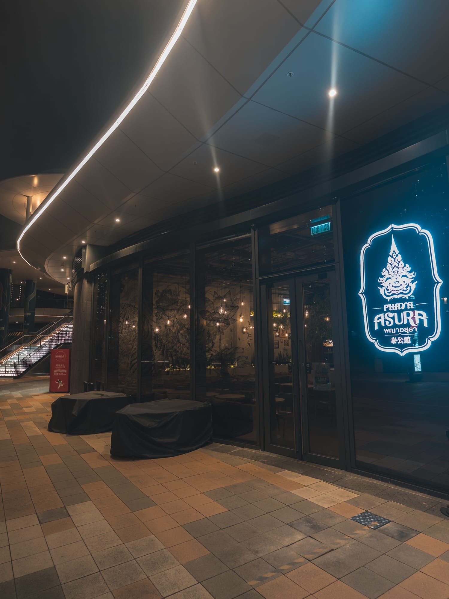

每次吃泰菜，你的必點清單是否總離不開 Pad Thai、冬蔭功或青木瓜沙律？直到最近拜訪了位於九龍城啟德海傍的 **泰公館 (Phaya Asura)**，才驚覺原來泰國家庭料理（Thai Home-cooking）的世界，遠比我們想像中廣闊且精緻！

這間座落於啟德體育園美食海灣的餐廳，是 Asura Thai 旗下最具體驗感的旗艦泰式餐廳。在這裡，沒有傳統泰國餐廳常見的金色神龕或沉重木雕。取而代之的，是微水泥清水模牆身、高挑的工業風天花板，以及充滿熱帶風情的盎然綠植。吹著海風吃一頓飯，真的會讓人一秒產生置身曼谷昭披耶河畔（Chao Phraya River）文創園區的渡假錯覺。

{/* Affiliate 1: 解決交通與周邊娛樂痛點 (Target: 週末去啟德體育園玩樂的家庭/情侶) */}
<AffiliateCard 
  type="klook"
  title="週末啟德一日遊：周邊熱門活動套票" 
  description="計劃去啟德海濱長廊散步或參觀體育園？建議提前預訂周邊的展覽或娛樂體驗門票，享受獨家折扣，讓週末行程更豐富圓滿。" 
  link="[Placeholder: Klook 啟德/九龍城相關活動連結]" 
  buttonText="查看 Klook 專屬優惠" 
/>

---

## 空間美學與品牌故事：空少的「平民 Fine Dining」夢

走進室內，視覺焦點立刻被中央一棵綁著泰國傳統彩色布條的大樹所吸引。牆上一幅巨大且極具張力的泰式神話黑白線條塗鴉，配上昏黃的鎢絲吊燈，將空間的藝術氣息拉滿。

這份對細節的執著，源自於主理人 Ken 的一場「Dream Shop」圓夢之旅。Ken 自小在曼谷長大、生活了十多年。疫情期間近乎停工的「空少」經歷促使他創業，在成功開設三間「Asura泰沾麵」後，他決定將曾經在米芝蓮法國菜餐廳實習的經驗結合泰菜，推出這間主打「平民 Fine Dining」的泰公館。

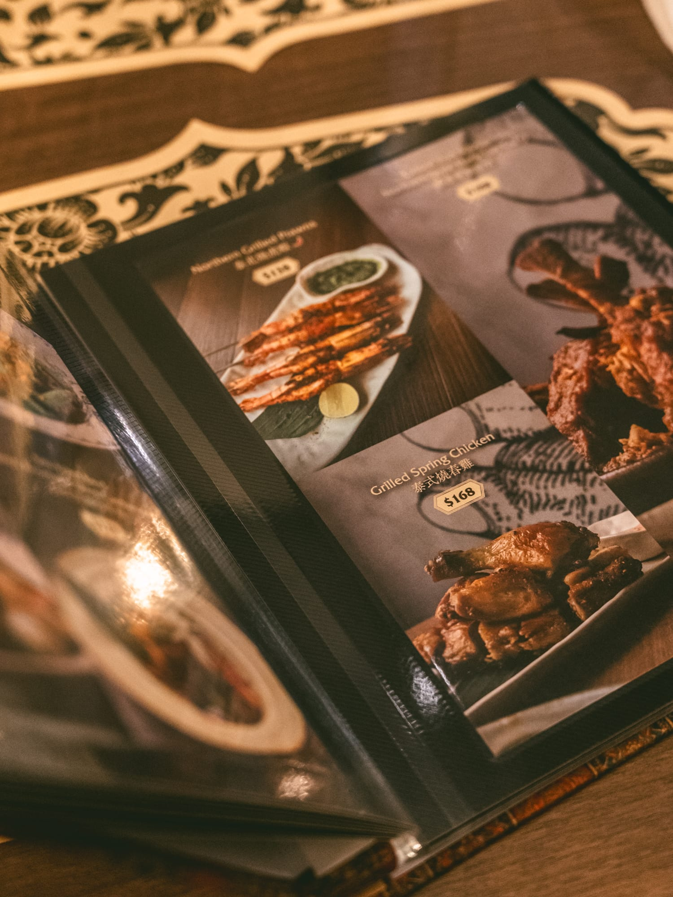

他知難而行，不隨波逐流做大眾口味，反而特地從泰國空運許多香港極罕見的在地食材。翻開像復古家庭相簿一樣的菜單、看著他親自去泰國挑選的一碗一碟，你能深刻感受到他想把泰式家常溫度原汁原味帶到香港的用心。

<RestaurantInfoCard 
  name="泰公館 Phaya Asura"
  address="九龍城啟德承啟道 38-39 號啟德體育園美食海灣地下 DC-005 號舖"
  hours="星期一至日 12:00 - 22:00"
  googleMapLink="[Placeholder: Google Map 連結]"
  igLink="[Placeholder: Instagram 連結]"
  igHandle="@phaya_asura"
/>

---

## 菜單深度開箱：顛覆認知的精緻家常菜

當晚我們點了多道招牌菜，每一道都猶如藝術品，從命名到做法都極具記憶點。

### ✨ 開胃前菜：極致爽脆與儀式感

*   **蟹肉黑金杯 (Crab Delight)**：作為開場，這道菜視覺先聲奪人。酥脆的舟葉形黑金杯盛載著鮮甜蟹肉與清香荔枝，頂端點綴著閃亮金箔。入口微酸清爽，充滿精緻的泰式宴客感。
*   **香蕉花沙律 & 炸香蕉花**：香蕉花在香港極其罕見，處理工序繁複，具清熱解毒功效。餐廳將新鮮花瓣切成幼絲，搭配大隻彈牙的虎蝦與荔枝，淋上酸辣醬汁，爽脆開胃。另一種做法則是裹上薄漿酥炸，外脆內嫩，非常惹味。
*   **農夫椰芯 & 蝦膏蓮藕莖**：這兩道是絕對的「白飯殺手」！取自椰樹頂端的農夫椰芯，質地如幼筍般爽脆無渣，帶天然椰香；中空的蓮藕莖則大火爆炒，瞬間吸飽濃郁的泰式蝦膏與辣椒醬，鹹香微辣，極具鑊氣。

{/* 橫向滑動圖片庫 - 前菜 */}

  <figure class="snap-center shrink-0 w-[85%] sm:w-80 m-0 flex flex-col">
    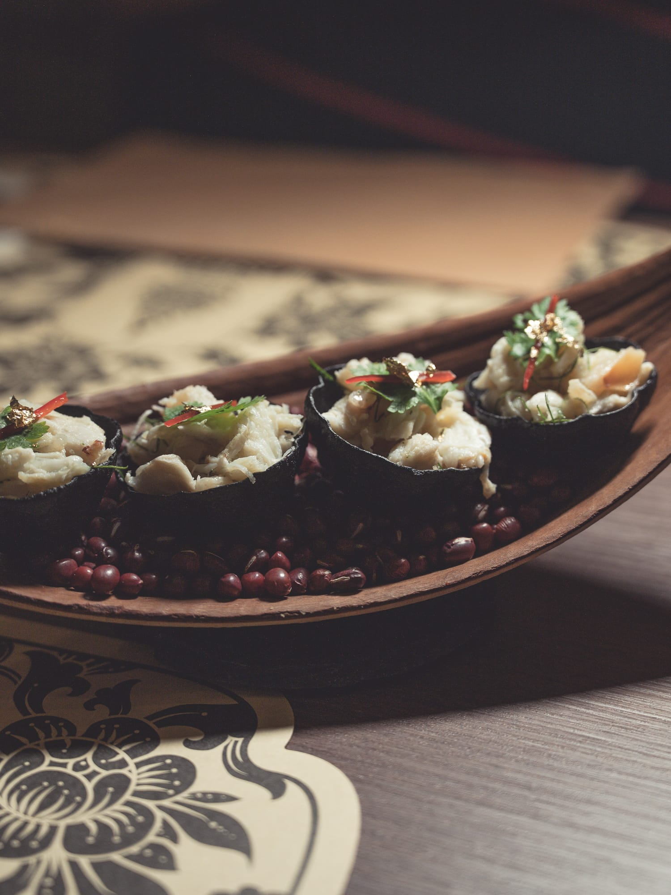
    <figcaption class="text-center text-sm text-muted-foreground mt-3 italic">蟹肉黑金杯：以金箔點綴，充滿泰式宴客儀式感</figcaption>
  </figure>
  <figure class="snap-center shrink-0 w-[85%] sm:w-80 m-0 flex flex-col">
    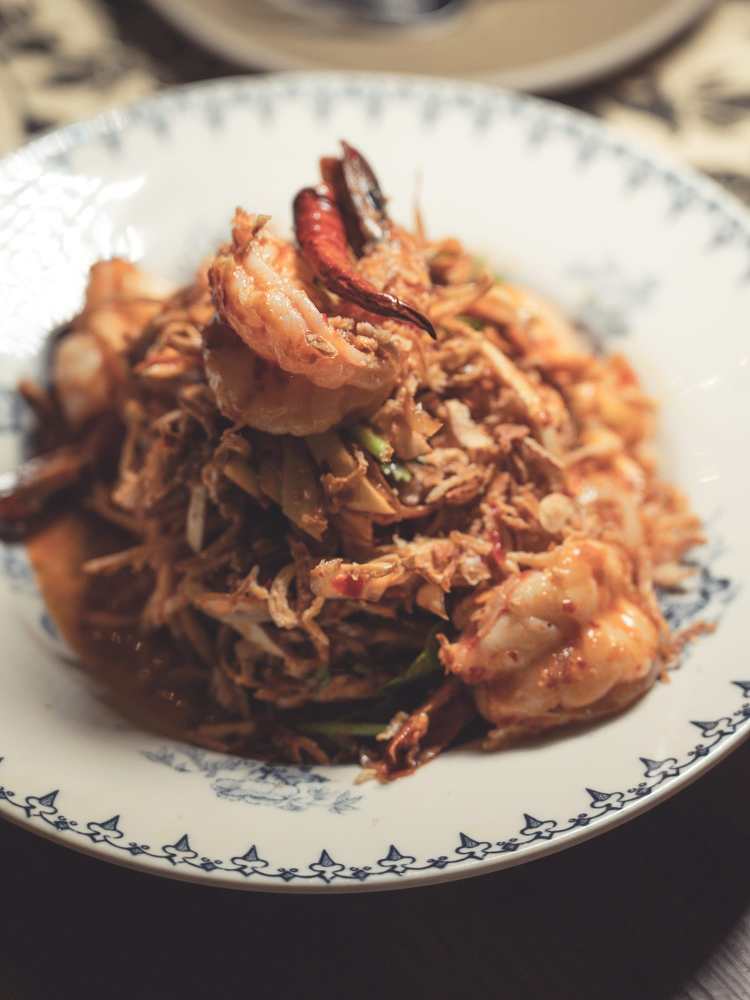
    <figcaption class="text-center text-sm text-muted-foreground mt-3 italic">香蕉花沙律：配上大隻虎蝦，酸辣爽脆極開胃</figcaption>
  </figure>
  <figure class="snap-center shrink-0 w-[85%] sm:w-80 m-0 flex flex-col">
    
    <figcaption class="text-center text-sm text-muted-foreground mt-3 italic">農夫椰芯：質地如幼筍般爽脆，帶有天然椰香</figcaption>
  </figure>
  <figure class="snap-center shrink-0 w-[85%] sm:w-80 m-0 flex flex-col">
    
    <figcaption class="text-center text-sm text-muted-foreground mt-3 italic">蝦膏蓮藕莖：吸滿濃郁泰式蝦膏，鑊氣十足</figcaption>
  </figure>

### 🥘 驚艷主菜：火候與香料的完美碰撞

*   **可能係通菜？**：名字有趣，卻最見真章！廚師將新鮮通菜細心切成如麵條般的幼絲，即叫即炒。通菜絲完美鎖緊蒜頭與辣椒的鑊氣，像吃綠色蔬菜麵般幼嫩爽脆，把一道家常炒菜演繹出了極致精細的層次感。

*   **生榴槤瑪莎曼咖喱**：聽起來大膽，吃起來卻和諧得讓人拍案叫絕！嚴選未熟透的生榴槤慢火細心燉煮，完全沒有刺鼻濃味，反而化作如栗子般綿密的口感，並帶有淡淡甘甜。肉桂、八角與椰奶熬煮的咖喱溫潤香濃，完美滲透進肉塊之中。
*   **羅望子筍殼魚**：巧妙融入日式「立鱗燒」技藝，高溫油淋令這條泰國國寶魚的魚鱗像松果般朵朵立起、金黃香脆。魚肉依然鮮嫩多汁，淋上羅望子酸甜濃醬，優雅化解油膩感。
*   **白豆蔻爆炒牛肉 & 泰式燒澳洲 A5 和牛**：喜歡牛的朋友必試！白豆蔻自帶柑橘微酸與樟木辛香，與鮮嫩牛肉粒猛烈爆炒，多重香氣在口中碰撞。而燒 A5 和牛則烤至完美的粉紅色，肉質軟腍細緻，油脂甘香。
*   **燒漢來豬肋骨**：選用泰北經典古法咖喱醬料醃製，不加椰奶，突顯天然草本香料風味。豬肋骨經過長時間慢煮，肉質軟嫩得入口即化。

{/* 橫向滑動圖片庫 - 主菜 */}

  <figure class="snap-center shrink-0 w-[85%] sm:w-80 m-0 flex flex-col">
    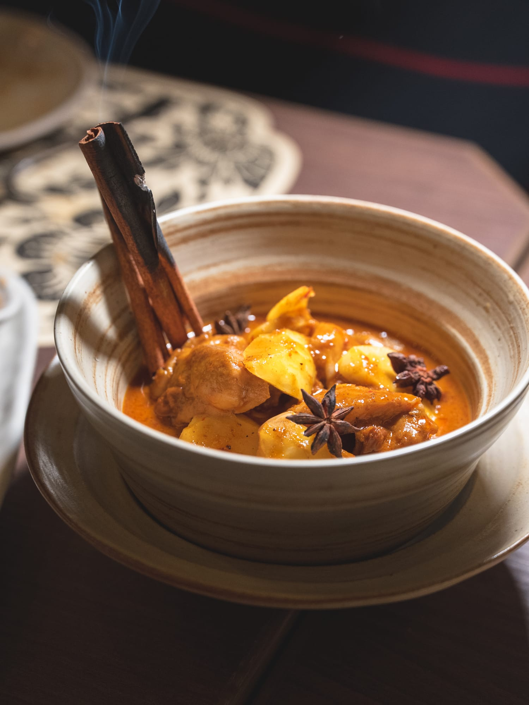
    <figcaption class="text-center text-sm text-muted-foreground mt-3 italic">生榴槤瑪莎曼咖喱：生榴槤慢煮後口感如綿密栗子</figcaption>
  </figure>
  <figure class="snap-center shrink-0 w-[85%] sm:w-80 m-0 flex flex-col">
    
    <figcaption class="text-center text-sm text-muted-foreground mt-3 italic">羅望子筍殼魚：融入「立鱗燒」技藝，魚鱗金黃香脆</figcaption>
  </figure>
  <figure class="snap-center shrink-0 w-[85%] sm:w-80 m-0 flex flex-col">
    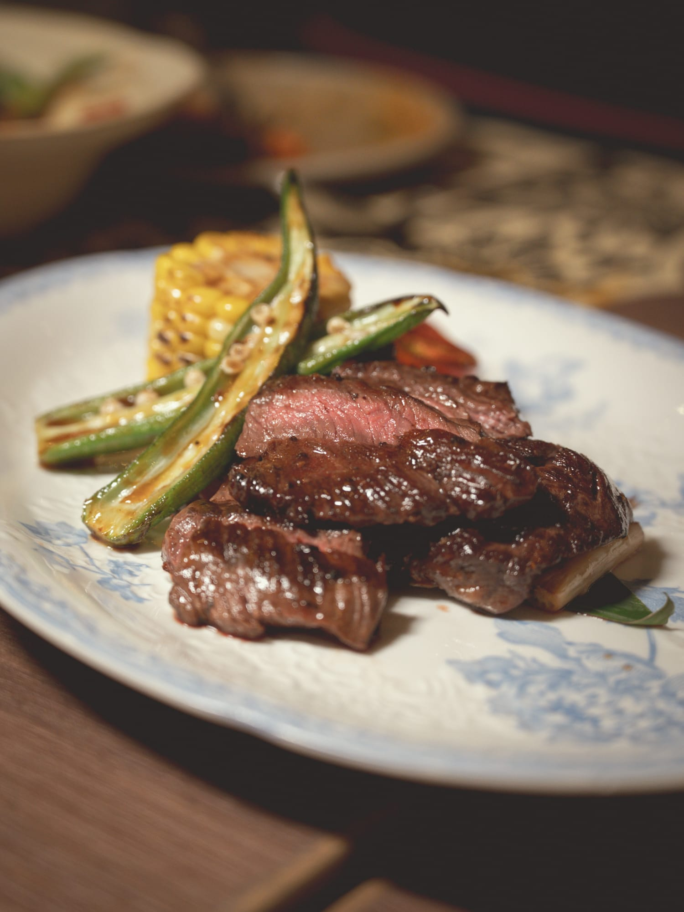
    <figcaption class="text-center text-sm text-muted-foreground mt-3 italic">泰式燒澳洲 A5 和牛：烤至完美粉紅色，油脂甘香</figcaption>
  </figure>

### 🍜 湯品與主食：層次豐富的味覺結尾

*   **撚盡湯 (Ranjuan Soup)**：湯名意為「令人魂牽夢縈的香氣」，是拉瑪五世皇時期的宮廷名菜。以泰國蝦醬、香茅、南薑等熬煮，湯底清澈但色澤深沉，排骨燉得極軟嫩。入口鹹香酸辣，草本香氣久久不散，風味深度令人忘卻冬蔭功。
*   **泰式乾炒酸辣壽喜燒 & 欖角炒飯**：壽喜燒配上大蝦與魷魚炒得乾身惹味；而欖角炒飯則擺盤豐富，面層鋪滿脆口肉鬆，是極具人氣的飽肚之選。

{/* 橫向滑動圖片庫 - 湯與主食 */}

  <figure class="snap-center shrink-0 w-[85%] sm:w-80 m-0 flex flex-col">
    
    <figcaption class="text-center text-sm text-muted-foreground mt-3 italic">撚盡湯：泰國宮廷名菜，草本香氣與酸辣風味極具層次</figcaption>
  </figure>
  <figure class="snap-center shrink-0 w-[85%] sm:w-80 m-0 flex flex-col">
    
    <figcaption class="text-center text-sm text-muted-foreground mt-3 italic">乾炒酸辣壽喜燒：配以海鮮，炒得非常乾身惹味</figcaption>
  </figure>

### 🍨 甜品：傳統與創新的甜蜜交響

*   **泰公館椰子真西米露**：連甜品都不隨便！堅持採用泰國南部進口的有機新鮮「真西米」，晶瑩剔透，口感自然煙靭有咬口。配上帶微鹹的香濃椰奶，甜而不膩。
*   **燒麵包配咖央醬**：烤得外酥內軟的厚切麵包，夾著濃郁的綠色咖央醬與雪糕，冷熱交融的邪惡美味。

{/* 橫向滑動圖片庫 - 甜品 */}

  <figure class="snap-center shrink-0 w-[85%] sm:w-80 m-0 flex flex-col">
    
    <figcaption class="text-center text-sm text-muted-foreground mt-3 italic">泰公館真西米露：進口有機「真西米」，晶瑩剔透且煙靭</figcaption>
  </figure>
  <figure class="snap-center shrink-0 w-[85%] sm:w-80 m-0 flex flex-col">
    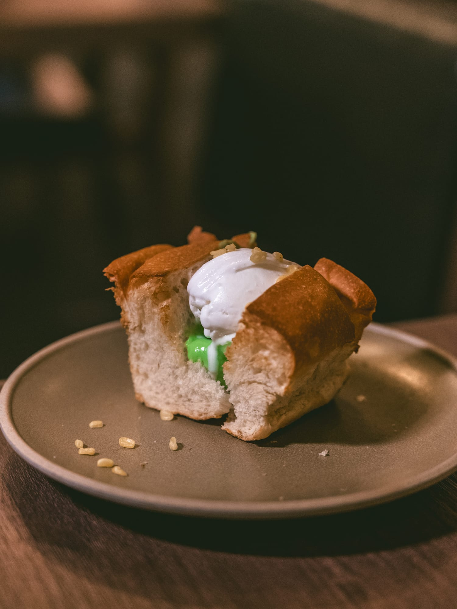
    <figcaption class="text-center text-sm text-muted-foreground mt-3 italic">燒麵包配咖央醬：冰火交融的泰式特色甜品</figcaption>
  </figure>

---

## 吹著海風微醺：充滿驚喜的泰式 Cocktail

除了美食，這裡的飲品同樣將 Fine Dining 的體驗延伸到了酒水層面：

*   **Mali kiss (茉莉花之吻)**：高腳杯上綁著美麗的白色花朵，金黃色酒體覆蓋著綿密泡沫與乾燥花苞。完美結合了茉莉花香與草本氣息，口感溫柔，極度適合打卡。
*   **冬蔭公 (冬薩公) 凍湯 Cocktail**：顛覆視覺之作！酒體完全澄清透明，配上發光杯墊，入口卻真實帶有冬蔭功的酸辣鹹香，火候控制得恰到好處，是非常有趣的刺激體驗。
*   **泰式奶茶 Cocktail**：將經典泰國國民飲品化身微醺版本，頂層覆蓋綿密奶泡，茶香與酒感的平衡拿捏得極好。

{/* 橫向滑動圖片庫 - 飲品 */}

  <figure class="snap-center shrink-0 w-[85%] sm:w-80 m-0 flex flex-col">
    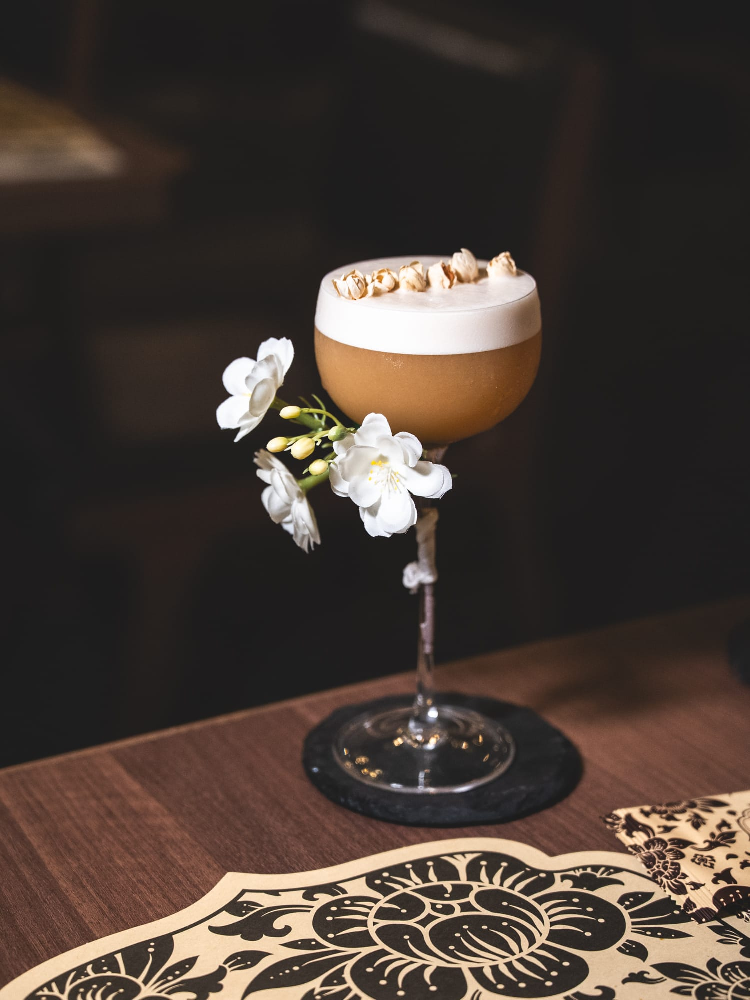
    <figcaption class="text-center text-sm text-muted-foreground mt-3 italic">Mali Kiss：帶有茉莉花香與草本氣息，顏值極高</figcaption>
  </figure>
  <figure class="snap-center shrink-0 w-[85%] sm:w-80 m-0 flex flex-col">
    
    <figcaption class="text-center text-sm text-muted-foreground mt-3 italic">冬蔭公凍湯 Cocktail：顛覆視覺，入口卻是真實冬蔭功風味</figcaption>
  </figure>
  <figure class="snap-center shrink-0 w-[85%] sm:w-80 m-0 flex flex-col">
    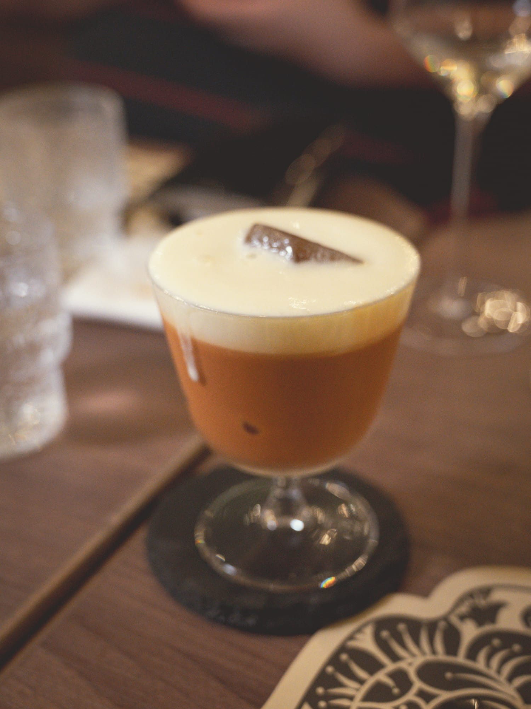
    <figcaption class="text-center text-sm text-muted-foreground mt-3 italic">泰式奶茶 Cocktail：經典國民飲品的微醺變奏版</figcaption>
  </figure>

{/* Affiliate 2: 解決餐後住宿/Staycation 需求 (Target: 想在東九龍區渡假的情侶/毛孩家長) */}
<AffiliateCard 
  type="agoda"
  title="延續慢活週末：九龍東寵物友善 Staycation 推介" 
  description="吃飽喝足不想回家？啟德及九龍東一帶有不少高質素且 Pet-Friendly 的酒店，為您與毛孩打造最完美的週末小旅行。" 
  link="[Placeholder: Agoda 啟德區寵物友善酒店連結]" 
  buttonText="查看 Agoda 最新房價" 
/>

---

## 💡 編輯私房 Tips：讓你的體驗更完美

1.  **日落時分最浪漫**：建議預訂傍晚 6 點左右的座位，可以一次過欣賞啟德海傍的日落晚霞與入夜後的璀璨夜景。
2.  **帶毛孩放電必去**：餐廳對毛孩極度友善。建議提早到達，先在餐廳外的啟德海濱長廊讓狗狗散步放電，再入座享用大餐。
3.  **大膽嘗試新事物**：不要只點安全的菜式！強烈建議勇敢點「生榴槤瑪莎曼咖喱」與「可能係通菜」，絕對會刷新你對泰菜的認知。

{/* Affiliate 3: 網卡需求 (Target: 海外旅客/台灣遊客) */}
<AffiliateCard 
  type="klook"
  title="打卡必備：香港無限數據 eSIM" 
  description="想即時在 IG 分享超美的無敵海景與精緻泰菜？準備好一張無限數據 eSIM，到達香港即插即用，隨時隨地上線。" 
  link="[Placeholder: Klook eSIM 連結]" 
  buttonText="即看 Klook eSIM 優惠" 
/>

---

### 更多美食與空間特寫 (Photo Gallery)

  <figure class="snap-center shrink-0 w-[90%] sm:w-80 m-0 flex flex-col">
    
    <figcaption class="text-center text-sm text-muted-foreground mt-3 italic">充滿藝術感的室內壁畫</figcaption>
  </figure>

  <figure class="snap-center shrink-0 w-[90%] sm:w-80 m-0 flex flex-col">
    
    <figcaption class="text-center text-sm text-muted-foreground mt-3 italic">民族風情的舒適卡座</figcaption>
  </figure>
  
  <figure class="snap-center shrink-0 w-[90%] sm:w-80 m-0 flex flex-col">
    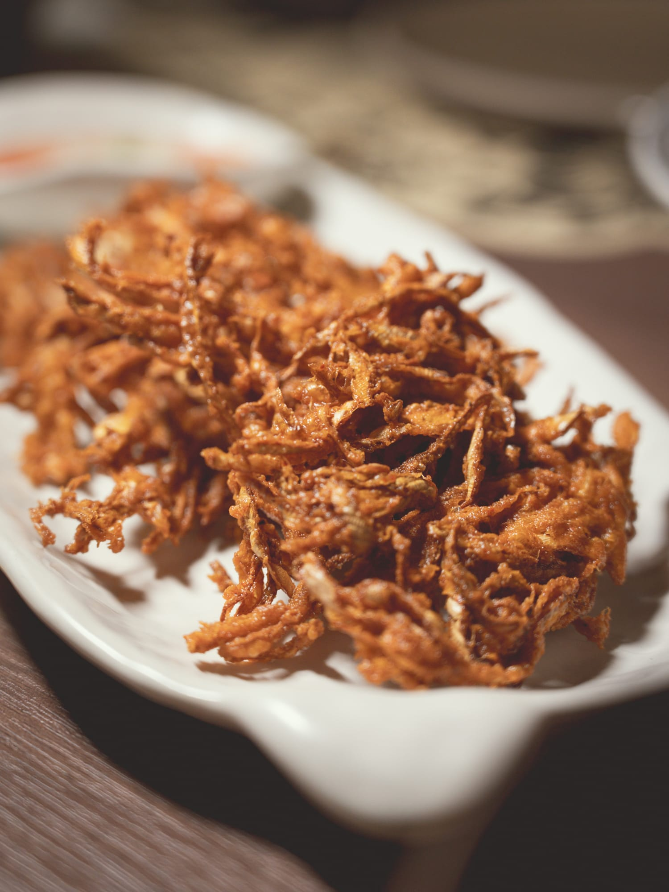
    <figcaption class="text-center text-sm text-muted-foreground mt-3 italic">金黃酥脆的炸香蕉花</figcaption>
  </figure>

  <figure class="snap-center shrink-0 w-[90%] sm:w-80 m-0 flex flex-col">
    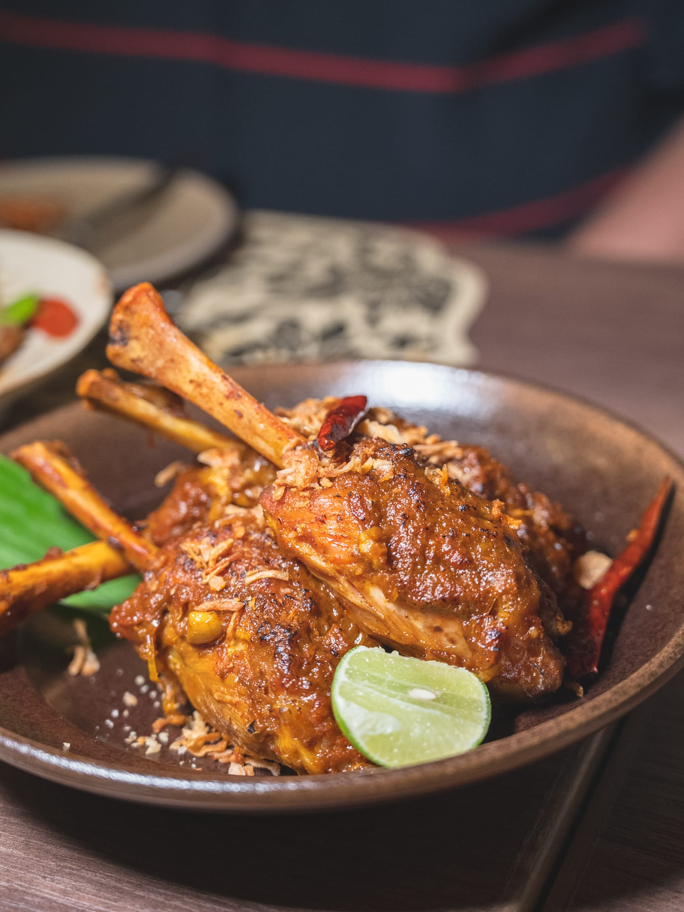
    <figcaption class="text-center text-sm text-muted-foreground mt-3 italic">入口即化的燒漢來豬肋骨</figcaption>
  </figure>
  
  <figure class="snap-center shrink-0 w-[90%] sm:w-80 m-0 flex flex-col">
    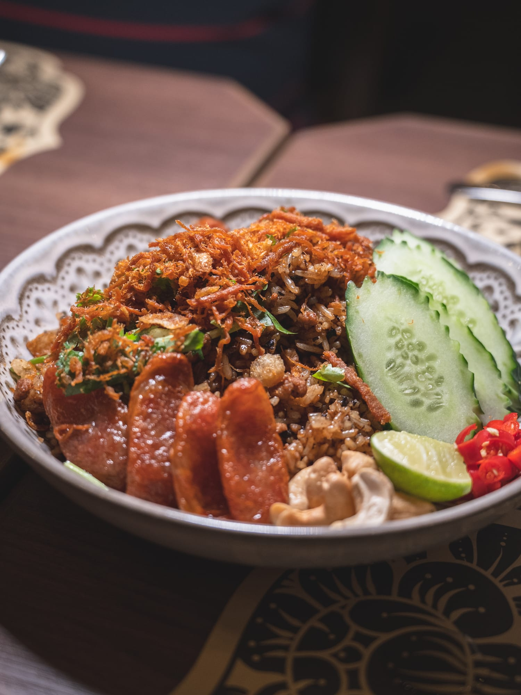
    <figcaption class="text-center text-sm text-muted-foreground mt-3 italic">配料豐富的欖角炒飯</figcaption>
  </figure>

