import AffiliateCard from '@/components/AffiliateCard.astro';
import RestaurantInfoCard from '@/components/RestaurantInfoCard.astro';

When you crave Thai food, does your go-to order usually consist of Pad Thai, Tom Yum soup, or green papaya salad? It wasn't until a recent visit to **Phaya Asura** along the Kai Tak waterfront in Kowloon City that I realized the world of authentic Thai home-cooking is vastly more expansive and refined than we give it credit for. 

Located in the Dining Cove of the Kai Tak Sports Park, this is the flagship experiential restaurant under the Asura Thai brand. You won't find the stereotypical golden shrines or heavy wooden carvings here. Instead, you're greeted by minimalist micro-cement walls, high industrial ceilings, and lush tropical greenery. Enjoying a meal here with the ocean breeze blowing through genuinely makes you feel like you've been teleported to a trendy creative district along Bangkok's Chao Phraya River.

{/* Affiliate 1: Solving transportation/entertainment needs for weekenders */}
<AffiliateCard 
  type="klook"
  title="Kai Tak Weekend Getaway: Popular Nearby Activity Passes" 
  description="Planning a stroll along the Kai Tak Promenade or a visit to the Sports Park? Book your exhibition or entertainment tickets in advance to score exclusive discounts and make your weekend itinerary complete." 
  link="[Placeholder: Klook Kai Tak/Kowloon City Activities Link]" 
  buttonText="View Exclusive Klook Offers" 
/>

---

## Spatial Aesthetics & Brand Story: A Flight Attendant's "Accessible Fine Dining" Dream

Upon entering, your eyes are immediately drawn to a large tree in the center of the room, wrapped in traditional colorful Thai ribbons. An expansive, highly striking black-and-white mural of Thai mythology covers the wall, illuminated by warm tungsten pendant lights that dial up the artistic ambiance of the space.

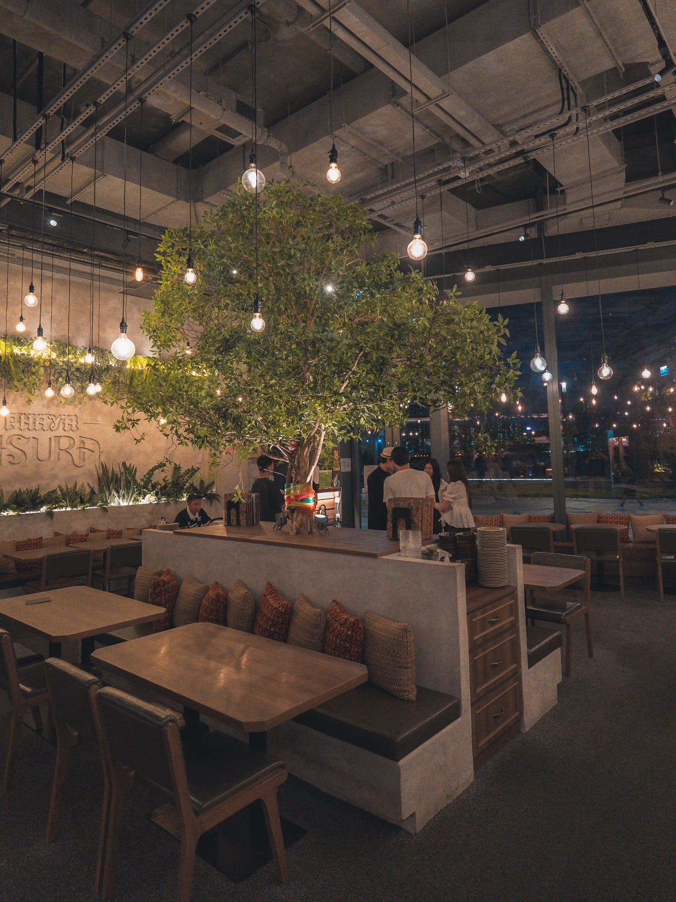

This obsessive attention to detail stems from the owner, Ken, and his journey to build his "Dream Shop". Ken grew up and lived in Bangkok for over a decade. When his career as a flight attendant was effectively grounded during the pandemic, he pivoted to entrepreneurship. After successfully opening three branches of "Asura Thai Tsukemen," he decided to merge his past internship experience at a Michelin-starred French restaurant with his love for Thai food, resulting in Phaya Asura's "accessible fine dining" concept.

Rather than catering to mass-market tastes, Ken took the harder path: flying in rare, hyper-local Thai ingredients rarely seen in Hong Kong. Flipping through the menu—which is styled like a vintage family photo album—and eating from tableware he personally handpicked in Thailand, you can truly feel his dedication to bringing the warmth of a Thai home to Hong Kong.

<RestaurantInfoCard 
  name="Phaya Asura (泰公館)"
  address="Shop DC-005, G/F, Dining Cove, Kai Tak Sports Park, 38-39 Shing Kai Road, Kai Tak, Kowloon City"
  hours="Monday - Sunday 12:00 PM - 10:00 PM"
  googleMapLink="[Placeholder: Google Map Link]"
  igLink="[Placeholder: Instagram Link]"
  igHandle="@phaya_asura"
/>

---

## Deep Dive into the Menu: Mind-Blowing Refined Home Cooking

We ordered several signature dishes that night, and each felt like a work of art, memorable from their clever names down to their intricate preparations.

### ✨ Appetizers: Ultimate Crunch and Ceremony

*   **Crab Delight:** A visual showstopper right out of the gate. A crispy, boat-shaped black cup holds sweet crab meat and fragrant lychee, all crowned with edible gold leaf. It’s bright, slightly tart, and sets a beautifully elegant tone for the meal.
*   **Banana Blossom Salad & Fried Banana Blossom:** Banana blossom is incredibly rare in Hong Kong and requires tedious prep work, but it's known for its detoxifying properties. The restaurant juliennes the fresh petals and pairs them with massive, bouncy tiger prawns and lychee in a tangy dressing. They also offer a version coated in a light batter and deep-fried—crispy on the outside, tender on the inside, and insanely addictive.
*   **Coconut Shoots & Lotus Stems:** These two are absolute "rice killers" (meaning you'll want extra bowls of rice)! The coconut shoots, harvested from the very top of the palm, have a satisfying, fibrous crunch similar to young bamboo, carrying a natural coconut aroma. The hollow lotus stems are flash-fried over high heat, acting as tiny sponges that instantly soak up the rich, slightly spicy, umami-bomb Thai shrimp paste.

{/* Horizontal Scroll Gallery - Appetizers */}

  <figure class="snap-center shrink-0 w-[85%] sm:w-80 m-0 flex flex-col">
    
    <figcaption class="text-center text-sm text-muted-foreground mt-3 italic">Crab Delight: Garnished with gold leaf for a touch of Thai banquet elegance.</figcaption>
  </figure>
  <figure class="snap-center shrink-0 w-[85%] sm:w-80 m-0 flex flex-col">
    
    <figcaption class="text-center text-sm text-muted-foreground mt-3 italic">Banana Blossom Salad: Tossed with tiger prawns in a wildly appetizing tangy dressing.</figcaption>
  </figure>
  <figure class="snap-center shrink-0 w-[85%] sm:w-80 m-0 flex flex-col">
    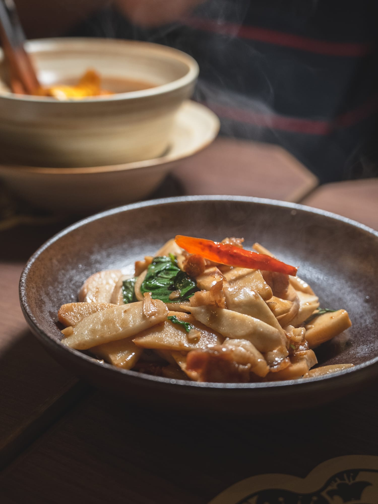
    <figcaption class="text-center text-sm text-muted-foreground mt-3 italic">Coconut Shoots: Crunchy like young bamboo with a hint of natural coconut.</figcaption>
  </figure>
  <figure class="snap-center shrink-0 w-[85%] sm:w-80 m-0 flex flex-col">
    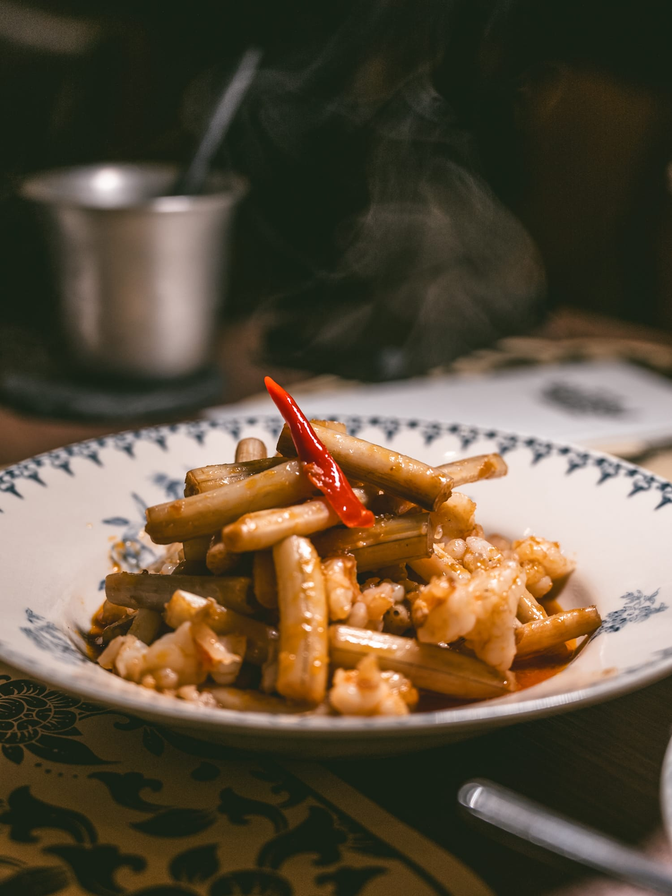
    <figcaption class="text-center text-sm text-muted-foreground mt-3 italic">Lotus Stems: Saturated with rich Thai shrimp paste and packed with "wok hei."</figcaption>
  </figure>

### 🥘 Show-Stopping Mains: Spices Meet Masterful Heat

*   **"Maybe Morning Glory?":** A playful name for a dish that proves the chef’s serious knife skills. Fresh morning glory is meticulously shredded into noodle-like strands and cooked to order. The fine shreds perfectly lock in the smoky garlic and chili flavors, eating almost like a bowl of crunchy green vegetable noodles. It elevates a humble home-cooked dish into something brilliantly complex.

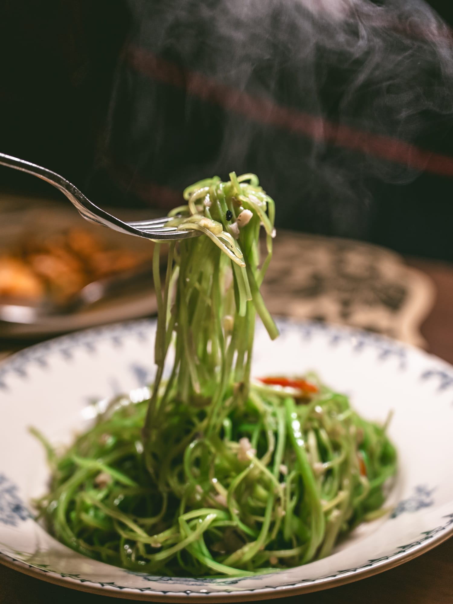

*   **Raw Durian Massaman Curry:** Sounds intimidating, but the harmony of flavors will blow your mind! Unripe durian is slowly simmered until it loses any pungent odor, transforming into a dense, creamy texture much like cooked chestnuts, bearing just a subtle sweetness. The curry itself is a warm, fragrant hug of cinnamon, star anise, and coconut milk that penetrates deeply into the meat.
*   **Tamarind Marble Goby:** This dish cleverly incorporates the Japanese "Matsukasa-yaki" (pinecone frying) technique. Blistering hot oil is poured over the skin so the scales stand up and fry to a golden, crispy crunch, while the meat of this prized Thai fish remains juicy and tender. It’s finished with a sweet and sour tamarind glaze that elegantly cuts through any richness.
*   **White Cardamom Stir-fried Beef & Grilled A5 Wagyu:** A must-order for beef lovers. White cardamom brings a unique citrusy and woody aroma to the fiercely wok-fried beef cubes. Meanwhile, the Australian A5 Wagyu is grilled to a flawless pink, boasting a melt-in-your-mouth texture and incredible fat marbling.
*   **Hanray Pork Ribs:** Marinated using an ancient Northern Thai curry recipe that omits coconut milk, allowing the raw, herbal spices to shine. The ribs are slow-cooked for hours until they practically fall off the bone.

{/* Horizontal Scroll Gallery - Mains */}

  <figure class="snap-center shrink-0 w-[85%] sm:w-80 m-0 flex flex-col">
    
    <figcaption class="text-center text-sm text-muted-foreground mt-3 italic">Raw Durian Massaman Curry: Slow-cooked unripe durian develops a creamy, chestnut-like texture.</figcaption>
  </figure>
  <figure class="snap-center shrink-0 w-[85%] sm:w-80 m-0 flex flex-col">
    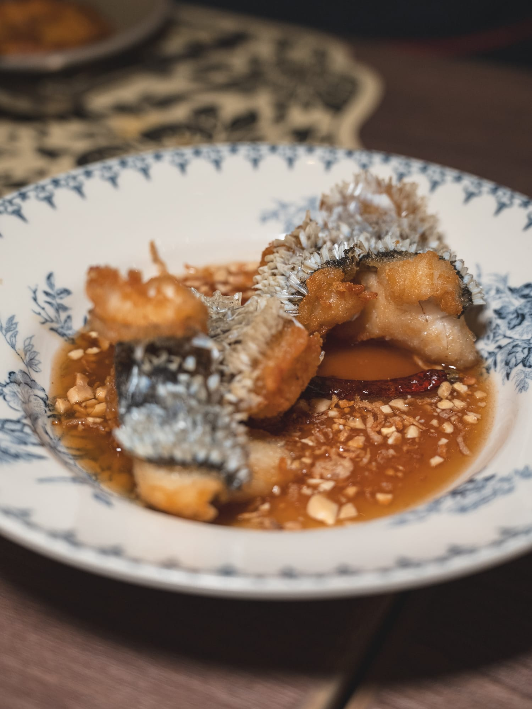
    <figcaption class="text-center text-sm text-muted-foreground mt-3 italic">Tamarind Marble Goby: Fried with a Japanese technique for perfectly crispy scales.</figcaption>
  </figure>
  <figure class="snap-center shrink-0 w-[85%] sm:w-80 m-0 flex flex-col">
    
    <figcaption class="text-center text-sm text-muted-foreground mt-3 italic">Grilled Australian A5 Wagyu: Cooked to a flawless pink with buttery, rich fat.</figcaption>
  </figure>

### 🍜 Soups & Carbs: A Deeply Layered Finish

*   **Ranjuan Soup:** The name translates to "a mesmerizing aroma," and it’s a historic royal dish from the era of King Rama V. Brewed with Thai shrimp paste, lemongrass, and galangal, the broth is surprisingly clear yet deep in color, hiding impossibly tender pork ribs. The savory, sour, and spicy herbal notes linger on the palate long after the last sip, offering a depth of flavor that might just make you forget about Tom Yum.
*   **Dry Thai Sukiyaki & Black Olive Fried Rice:** The sukiyaki is stir-fried dry with a fiery kick, tossed with large prawns and squid. The black olive fried rice comes beautifully plated, blanketed in a crispy layer of pork floss—a crowd-favorite for rounding out the meal.

{/* Horizontal Scroll Gallery - Soups & Carbs */}

  <figure class="snap-center shrink-0 w-[85%] sm:w-80 m-0 flex flex-col">
    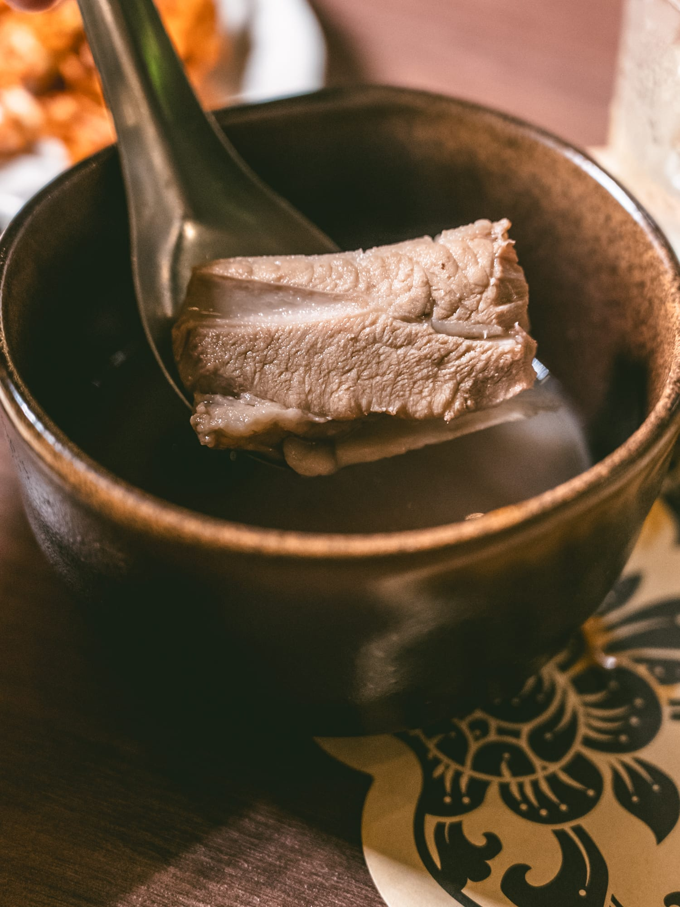
    <figcaption class="text-center text-sm text-muted-foreground mt-3 italic">Ranjuan Soup: A Thai royal classic delivering complex herbal, tart, and spicy notes.</figcaption>
  </figure>
  <figure class="snap-center shrink-0 w-[85%] sm:w-80 m-0 flex flex-col">
    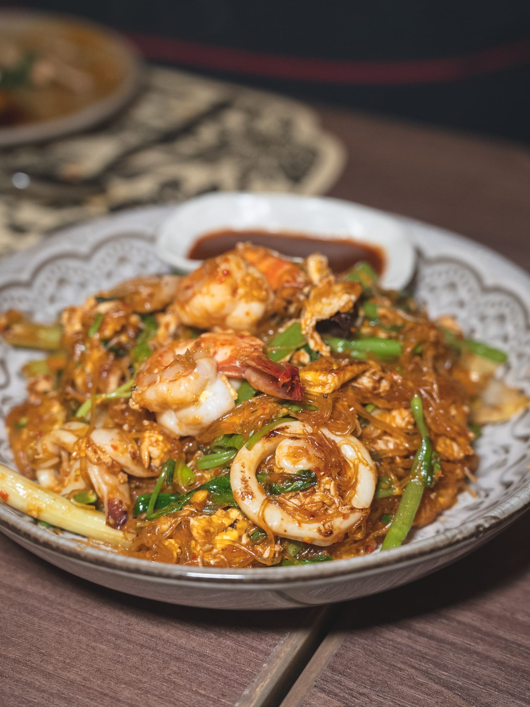
    <figcaption class="text-center text-sm text-muted-foreground mt-3 italic">Dry Sukiyaki: Intensely flavored and stir-fried with fresh seafood.</figcaption>
  </figure>

### 🍨 Desserts: A Sweet Symphony of Tradition and Innovation

*   **Authentic Thai Coconut Sago Soup:** They don't cut corners on dessert, either! They insist on using real, organic sago imported straight from Southern Thailand. It’s crystal clear with a naturally chewy bite, perfectly balanced by a rich, slightly salty coconut milk that keeps it from being overly sweet.
*   **Grilled Toast with Kaya:** Thick-cut bread grilled crisp on the outside and fluffy inside, sandwiching a vibrant green Kaya (coconut jam) and ice cream—a delightfully sinful hot-and-cold combo.

{/* Horizontal Scroll Gallery - Desserts */}

  <figure class="snap-center shrink-0 w-[85%] sm:w-80 m-0 flex flex-col">
    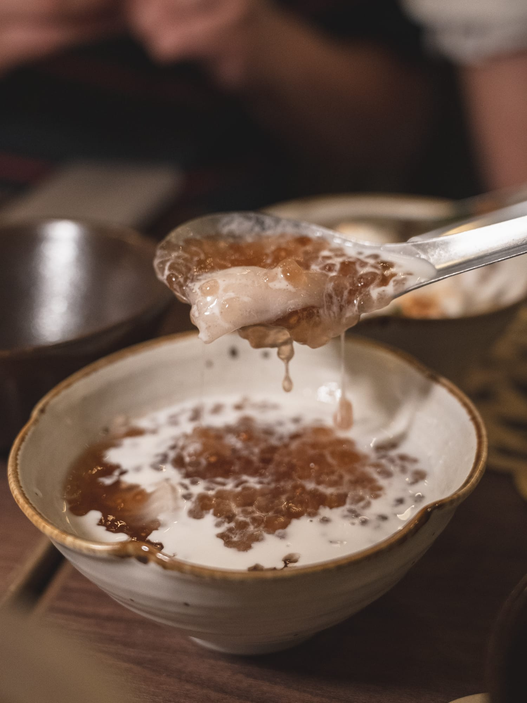
    <figcaption class="text-center text-sm text-muted-foreground mt-3 italic">Authentic Sago: Made with organic pearls for a crystal-clear, chewy finish.</figcaption>
  </figure>
  <figure class="snap-center shrink-0 w-[85%] sm:w-80 m-0 flex flex-col">
    
    <figcaption class="text-center text-sm text-muted-foreground mt-3 italic">Grilled Kaya Toast: An indulgent Thai treat mixing hot, crispy bread with cold ice cream.</figcaption>
  </figure>

---

## Tipsy by the Harbor: Surprising Thai Cocktails

The "fine dining" execution extends directly to their stellar beverage program:

*   **Mali Kiss:** Served in a stemmed glass adorned with a white flower, this golden cocktail is topped with a dense foam and dried buds. It’s a flawless marriage of jasmine floral notes and botanical flavors—gentle, refreshing, and incredibly Instagrammable.
*   **Clarified Tom Yum Cocktail:** A total mind-bender! The liquid is perfectly crystal clear and served on a glowing coaster, yet taking a sip hits you with the unmistakable tart, savory, and spicy punch of a real Tom Yum soup. It’s a wildly fun sensory trick.
*   **Thai Milk Tea Cocktail:** Taking Thailand’s national drink and giving it a boozy, adult spin. Crowned with a thick layer of milk foam, it achieves a stellar balance between earthy tea and spirits.

{/* Horizontal Scroll Gallery - Drinks */}

  <figure class="snap-center shrink-0 w-[85%] sm:w-80 m-0 flex flex-col">
    
    <figcaption class="text-center text-sm text-muted-foreground mt-3 italic">Mali Kiss: A gorgeous blend of jasmine and botanicals.</figcaption>
  </figure>
  <figure class="snap-center shrink-0 w-[85%] sm:w-80 m-0 flex flex-col">
    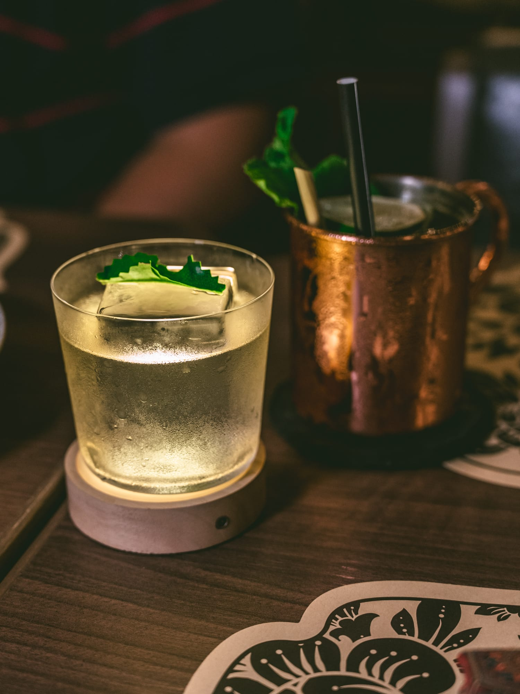
    <figcaption class="text-center text-sm text-muted-foreground mt-3 italic">Clarified Tom Yum: Defies logic—looks like water, tastes like the famous spicy soup.</figcaption>
  </figure>
  <figure class="snap-center shrink-0 w-[85%] sm:w-80 m-0 flex flex-col">
    
    <figcaption class="text-center text-sm text-muted-foreground mt-3 italic">Thai Milk Tea Cocktail: A perfectly balanced, boozy twist on the classic.</figcaption>
  </figure>

{/* Affiliate 2: Post-meal staycation needs */}
<AffiliateCard 
  type="agoda"
  title="Extend Your Weekend: Pet-Friendly Staycations in Kowloon East" 
  description="Too stuffed to go home? The Kai Tak and Kowloon East area boasts several high-quality, pet-friendly hotels. Treat yourself and your furry friend to the ultimate weekend micro-vacation." 
  link="[Placeholder: Agoda Kai Tak Pet-Friendly Hotels Link]" 
  buttonText="Check Latest Agoda Rates" 
/>

---

## 💡 Editor's Insider Tips: Maximizing Your Visit

1.  **Sunset is Prime Time:** I highly recommend booking a table around 6:00 PM. You’ll get to soak in the golden hour views over the Kai Tak waterfront, followed by the dazzling harbor nightscape.
2.  **Bring Your Pup:** The restaurant is exceptionally pet-friendly. Arrive a bit early to walk your dog along the Kai Tak Promenade to burn off some energy before sitting down to feast.
3.  **Be Adventurous:** Don’t just stick to the safe staples! I strongly urge you to try the "Raw Durian Massaman Curry" and the "Maybe Morning Glory?"—they will completely reshape your understanding of Thai cuisine.

{/* Affiliate 3: Connectivity for travelers */}
<AffiliateCard 
  type="klook"
  title="Travel Essential: Unlimited Data eSIM for Hong Kong" 
  description="Want to instantly upload those killer ocean views and gorgeous Thai dishes to IG? Grab an unlimited data eSIM—just activate upon arrival in HK and stay connected everywhere." 
  link="[Placeholder: Klook eSIM Link]" 
  buttonText="View Klook eSIM Deals" 
/>

---

### More Food & Space Highlights (Photo Gallery)

  <figure class="snap-center shrink-0 w-[90%] sm:w-80 m-0 flex flex-col">
    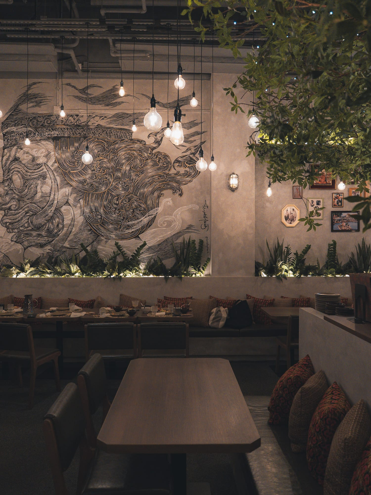
    <figcaption class="text-center text-sm text-muted-foreground mt-3 italic">Artistic interior murals set the mood</figcaption>
  </figure>

  <figure class="snap-center shrink-0 w-[90%] sm:w-80 m-0 flex flex-col">
    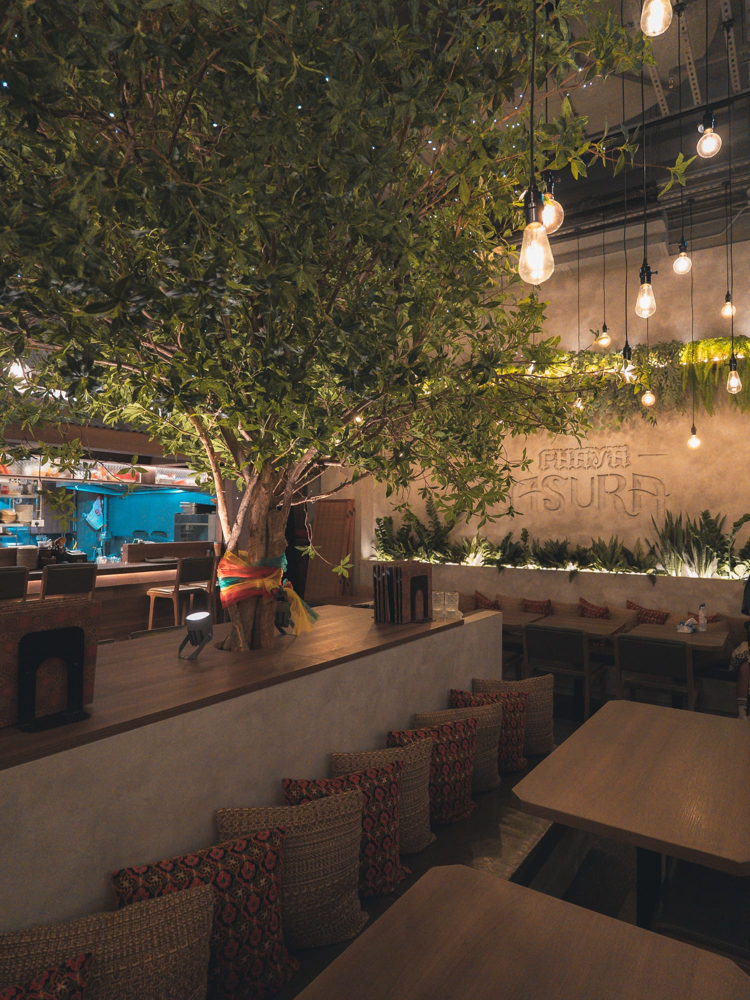
    <figcaption class="text-center text-sm text-muted-foreground mt-3 italic">Cozy booth seating with a bohemian flair</figcaption>
  </figure>
  
  <figure class="snap-center shrink-0 w-[90%] sm:w-80 m-0 flex flex-col">
    
    <figcaption class="text-center text-sm text-muted-foreground mt-3 italic">Perfectly golden fried banana blossom</figcaption>
  </figure>

  <figure class="snap-center shrink-0 w-[90%] sm:w-80 m-0 flex flex-col">
    
    <figcaption class="text-center text-sm text-muted-foreground mt-3 italic">Melt-in-your-mouth Hanray pork ribs</figcaption>
  </figure>
  
  <figure class="snap-center shrink-0 w-[90%] sm:w-80 m-0 flex flex-col">
    
    <figcaption class="text-center text-sm text-muted-foreground mt-3 italic">Flavor-packed black olive fried rice</figcaption>
  </figure>

