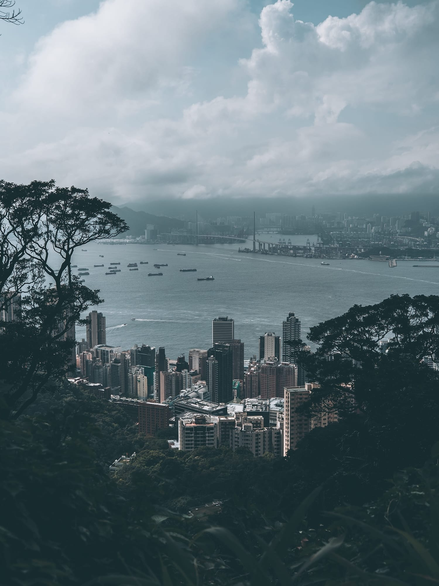

import AffiliateCard from '../../components/AffiliateCard.astro';

太平山（Victoria Peak），香港最具代表性的地標。但在多數人的印象裡，這裡似乎只剩下擁擠的纜車總站、凌霄閣，以及擠滿遊客的獅子亭。

然而，當我刻意避開主街道，沿著柯士甸山道向上行，再經由盧吉道繞行一圈後，我才發現——真正的太平山，一直被隱藏在濃霧與高度商業化的繁華背後。這是一趟從喧鬧走入極致孤獨，再從歷史遺跡步入自然奇觀的半日遊。

<AffiliateCard 
  type="klook"
  title="山頂纜車特快套票 (建議提前預訂)" 
  description="如果你也想避開總站與獅子亭的擁擠人潮，把體力留給接下來的深度探索，強烈建議先在網上購票，直接掃 QR Code 快速上山。" 
  link="https://www.klook.com/zh-HK/activity/xxxx" 
  buttonText="查看 Klook 專屬優惠" 
/>

---

## 喧鬧邊緣的維多利亞童話：柯士甸山遊樂場

乘巴士到達山頂總站後，我沒有跟隨人潮走向凌霄閣，而是沿路向著柯士甸山道走。第一站，我來到了柯士甸山遊樂場。

這是我第一次來，面積不大，但踏入的瞬間感覺像是跳到了另一個世界。一個帶有強烈金屬質感的小型涼亭矗立在翠綠的大草坪上，另一邊則是歐陸古典風格的噴水池。當天明明是平日，卻只有零星幾個遊客。我心裡不禁感嘆：這麼美的地方，為什麼沒有人來？

其實，這裡曾是前香港總督的後花園。因為缺乏大眾交通工具直接接駁，反而讓它幸運地成為了喧鬧旅遊區邊緣的一塊秘密花園，保留了十九世紀英國維多利亞時代的古典氣息。

## 權力巔峰的極致孤獨：舊總督山頂別墅守衛室

沿著柯士甸山道繼續往上走，高海拔的濕氣讓沿途的大樹披上了厚重的青苔。在綠意中，矗立著帶有精緻扭花與古典紋飾的舊式街燈。這種在現代香港市區已經絕跡的設計，默默提醒著我，這裡百年前曾是權力與財富的最頂端。

走到盡頭，出現了一座微小的白色古典建築——舊總督山頂別墅守衛室。這座建於 1900 至 1902 年間的建築，散發著濃厚的新古典與文藝復興氣派。雖然目前正在進行更新工程，工人們正把展覽品搬進去，我只能在外面駐足觀看。

看著這座孤立於山頭的微型建築，我忍不住幻想百年前在這裡當值的人，心裡到底是喜是悲？這裡環境雖美，但在那個交通極度不便的年代，獨自在這片濃霧籠罩的皇家園林中值勤，那種與世隔絕的孤獨感必定非常強烈。

守衛室旁，是一片地勢陷下去的廣闊盆地。這裡散落著幾個古典風涼亭與大木枱，四面被翠綠的山丘包圍。整個環境充滿了震撼力，而且——居然一個人都沒有。那一刻，我彷彿穿越到了外國，獨佔了這座神奇美妙的私人莊園。

## 神仙視角與縹緲仙氣

再繼續沿路攀升到最高點，映入眼簾的竟是一座帶著經典「老香港」建築風格的中式涼亭。在這充滿英式風格的公園裡，這座建於 1979 年、由石獅子鎮守的涼亭，形成了一種奇妙的文化交疊。

站在這個接近港島最高點的觀景台上，我經歷了整趟旅程最魔幻的時刻。霧氣像雲朵般高速掠過，整個空間充滿了縹緲的仙氣。從這裡居高臨下俯瞰剛才走過的花圃，彷彿切換到了「神仙的視角」在看地球，那種抽離與震撼，是任何繁華都市景觀都無法比擬的。

## 懸崖上的百年凝望：盧吉道與飛瀑

離開山頂公園，我沿著一條猶如被樹木包圍而成的「綠色隧道」往下走。從樹葉縫隙望去，香港仔與南丫島的海景若隱若現。

這條路連接到了大名鼎鼎的盧吉道。建於 1913 年至 1914 年間的盧吉道，其實是一項隱藏在懸崖上的世紀工程。工程人員在峭壁上以鋼筋三合土（混凝土）作為橋柱，硬生生在半空中架起了這條棧道。

漫步在這裡，就像走進了時光隧道。沿路有獨特的扭花金屬欄杆、古舊的老街燈，以及鋪滿青苔與鐵鏽的路牌。它就像一位靜默的長者，在高處默默注視著腳下維多利亞港的滄海桑田，陪著香港繼續經歷路程。

這裡不僅是工程奇蹟，更是一座天然生態展覽館。沿途一棵龐大的古印度榕樹（編號：LCSD CW/134），茂密的氣根跨越了整條步道，交織成一道天然的「樹根拱門」；而著名的「盧吉飛瀑」從深色岩壁飛瀉而下，充滿了動態的自然美感。

## 被遺忘的貴族通勤線：白加道纜車站

走完幽靜的盧吉道，回到凌霄閣旁的獅子亭，一瞬間彷彿被拉回了喧鬧的現實。大量遊客擠在欄杆前爭相拍照，我心裡不禁浮現一個疑問：「為什麼他們不到另一邊的盧吉道逛逛呢？」

為了避開人潮，我沿著極陡的小路往下，來到了空無一人的「白加道纜車站」。這座優雅的白色拱門車站擁有超過 130 年歷史，現為香港一級歷史建築。

看著眼前的極斜坡道，我滿腦子疑問：在距離總站這麼近、這麼陡的位置，到底誰會在這裡上下車？原來在早年，山頂是外籍富商與官員專屬居住區，這個站完全是為了讓達官貴人能從豪宅平緩地走到車站通勤而設的。

走在這樣炎熱的天氣與斜坡上，看著進站的復古纜車，那刻我真的有股衝動想直接跳上車坐一個站！

沿著舊山頂道返回凌霄閣時，從下而上的視角讓我發現了一座簡單卻優雅的建築——爐峰峽電力分站。這座建於 1928 年的建築，正是當年推動山頂現代化奢華生活的隱形推手。

## 完美的句號：The Peak Lookout

行程的最後，我來到了從小到大一直想去卻從未踏足的餐廳：The Peak Lookout (太平山餐廳)。這座充滿歐陸鄉村風情的紅磚小建築，入口處掛著斑駁生鏽的鐵鑄招牌，花園旁還有一棵超大榕樹。

走進室內，保留完好的石牆與拱窗散發著濃厚的古典韻味。然而令人深思的是，這座建築在 1901 年時，其實是供華人轎伕休息的底層勞工棚屋。昔日勞工揮灑汗水的避風港，如今已轉變為充滿浪漫情懷的高級消費場所。

一邊吃著肉汁豐富 (juicy)、麵包鬆軟的 Signature 牛肉漢堡，一邊在露天茶座看著太平山下的夜景，這場空間階級的翻轉與味覺的極致享受，為這趟旅程畫上了最完美的句號。

<AffiliateCard 
  type="agoda"
  title="The Murray, Hong Kong (美利酒店)" 
  description="下山後，如果想延續這份殖民時期的歷史感與優雅，位於中環纜車總站旁、由歷史建築活化改建的 The Murray 酒店，絕對是港島深度遊的最佳下榻選擇。" 
  link="https://www.agoda.com/zh-hk/xxxx" 
  buttonText="查看 Agoda 最新房價" 
/>

---

### Photo Gallery (太平山遺落的風景)

  
  
  
  
  
  
  

