import AffiliateCard from '@/components/AffiliateCard.astro';

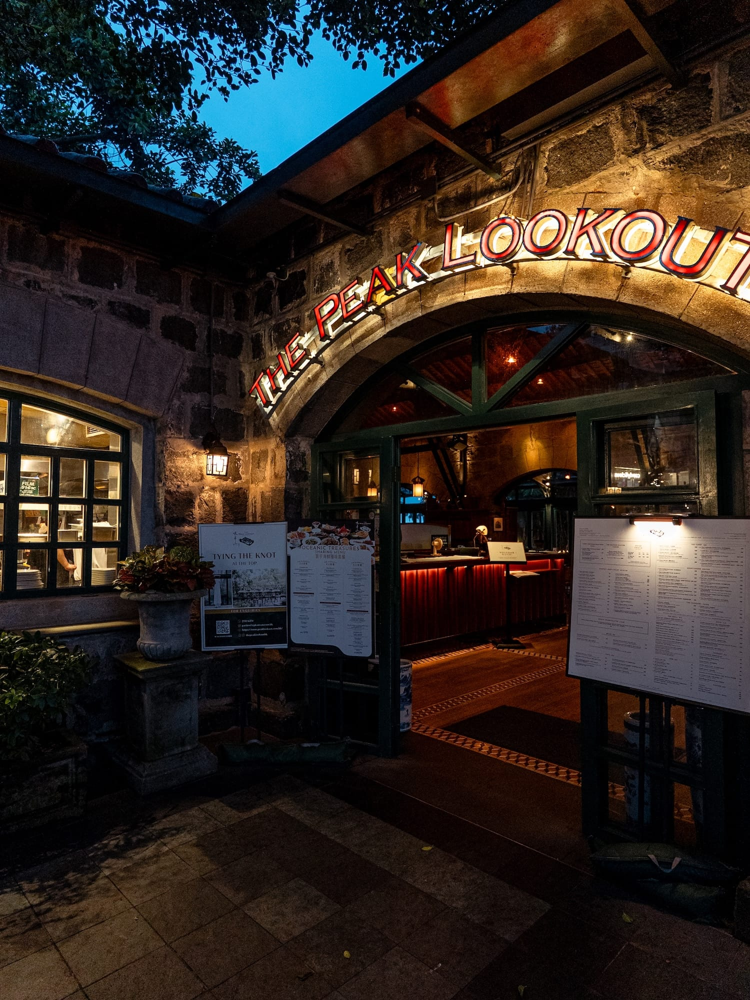

提到香港太平山頂，多數人的第一印象往往是凌霄閣的繁華與觀景台的擁擠。但在山頂纜車總站不遠處，隱藏著一座散發著濃縮了百年歲月、極具英國鄉間小屋風情的石砌紅頂建築——**The Peak Lookout (太平山餐廳)**。

這裡沒有倒模般的連鎖餐廳氛圍，取而代之的是粗獷的石牆、浪漫的玻璃天幕，以及彷彿能走進老電影場景的古典氣息。這不只是一頓晚餐，更是一場穿梭於香港百年歷史與異國情調的時光旅行。

{/* Affiliate 1: 解決上山交通痛點 (Target: 港台客極依賴 Klook) */}
<AffiliateCard 
  type="klook"
  title="山頂纜車特快套票 (建議提前預訂)" 
  description="想擁有最完美的約會體驗？強烈建議提前預訂纜車特快套票，省下排隊時間，將心情與體力留給接下來的百年浪漫晚餐。" 
  link="/go/klook-tram" 
  buttonText="查看 Klook 專屬優惠" 
/>

---

## 走過一世紀的傳奇：從轎夫椅棚到浪漫聖地

走進餐廳，石牆上掛著幾張泛黃的舊照片與極具歷史價值的文物，其中一枚刻有英皇愛德華七世與亞歷山德拉皇后頭像的古董勳章，默默訴說著這裡的身世。

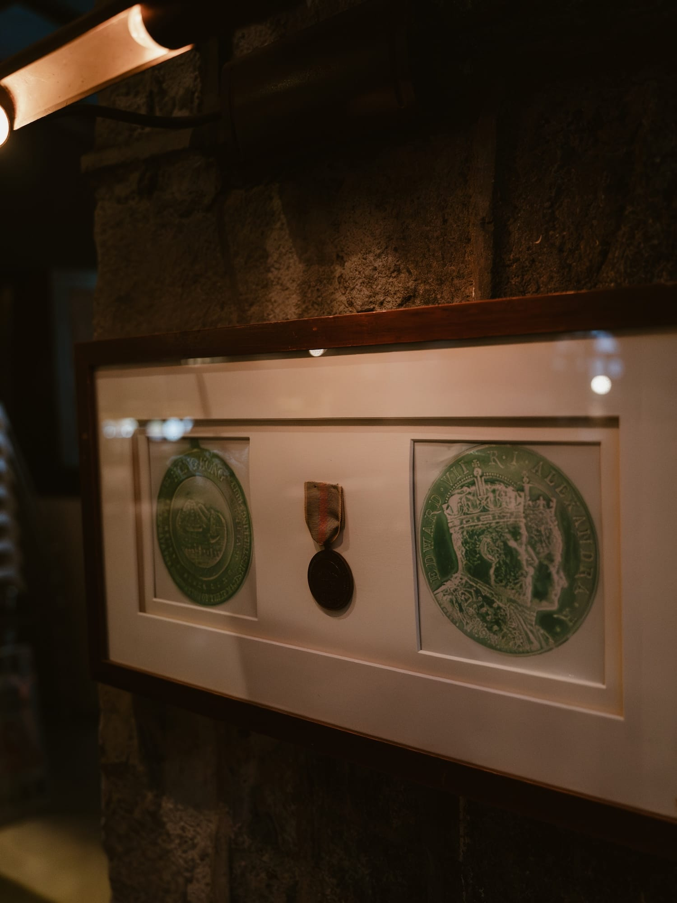

其實，這座被列為二級歷史建築的石屋，經歷了極其豐富的演變。早在 1880 年代，這裡最初被用作山頂纜車建造工程師的休息處。直到 1901 年，原址才建成了這座永久的石造「椅棚」，專門讓抬著洋人上落山頂的轎夫休息。

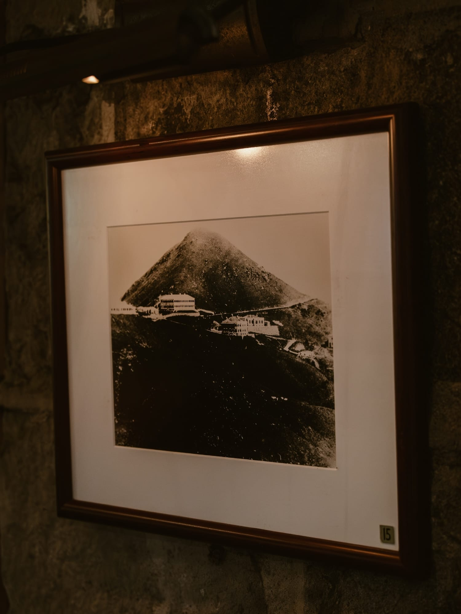

二戰期間，它曾短暫被日軍徵用為警署，戰後的 1947 年才正式搖身一變成為露天咖啡座「Old Peak Café」。這座曾經是底層勞工揮灑汗水的避風港，如今已被 Epicurean 集團打造成主打「East meets West」的高級國際菜餐廳，更成為了幾代香港人口耳相傳的「拍拖聖地」。

## 電影感滿溢的空間：玻璃天幕與百年古榕

The Peak Lookout 的迷人之處，在於它完美保留了 20 世紀初「Arts and Crafts」風格的建築特色。走進室內用餐區，映入眼簾的是極具歐陸小酒館風情的黑白幾何拼花地磚，以及極佳採光的玻璃天幕。

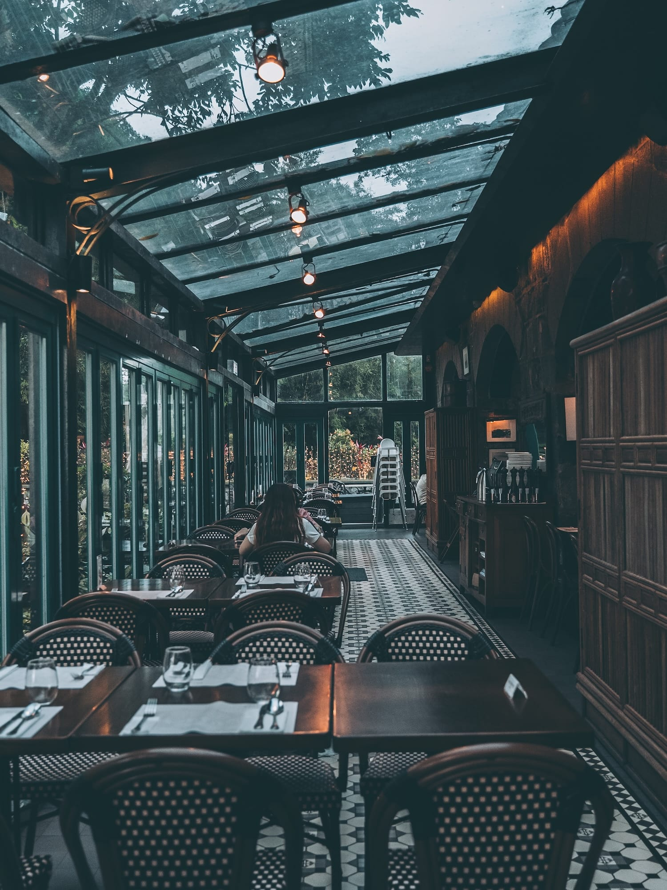

入夜後，巨大的復古鐵藝吊燈與吧台溫暖的垂墜燈飾亮起，高挑的木樑斜頂與粗獷的石牆在昏黃燈光下交織，讓人有種瞬間置身於外國古堡或老電影場景中的錯覺。

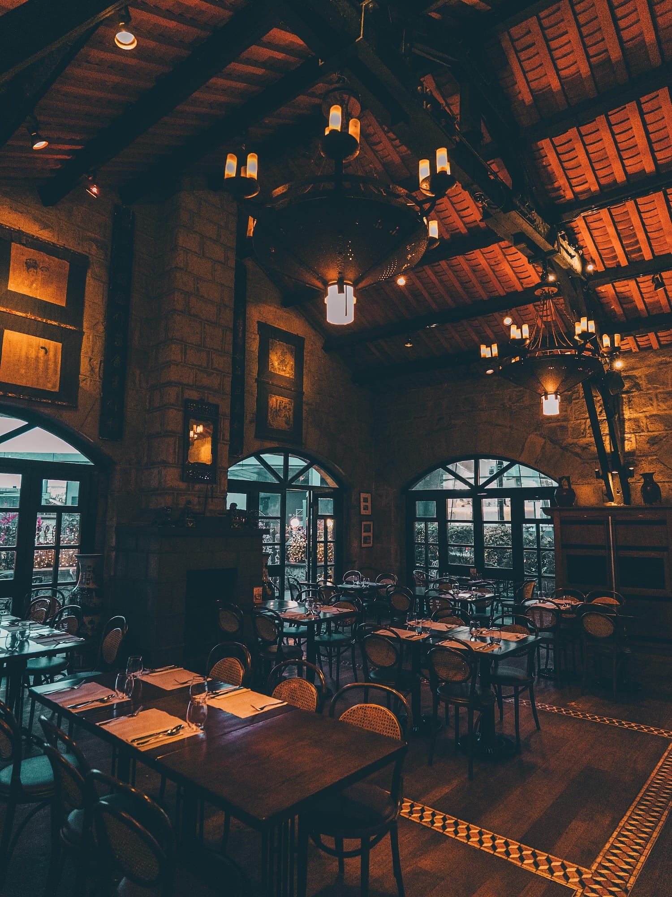

若天氣微涼，戶外的露天花園絕對是首選。一棵極具標誌性的巨大細葉榕盤踞在花園中央，長長的氣根如天然帷幕般垂下。到了傍晚，纏繞在樹幹與復古鐵花欄杆上的點點星燈閃爍，配上雲石圓桌與微霧籠罩的太平山景，浪漫得無可救藥。

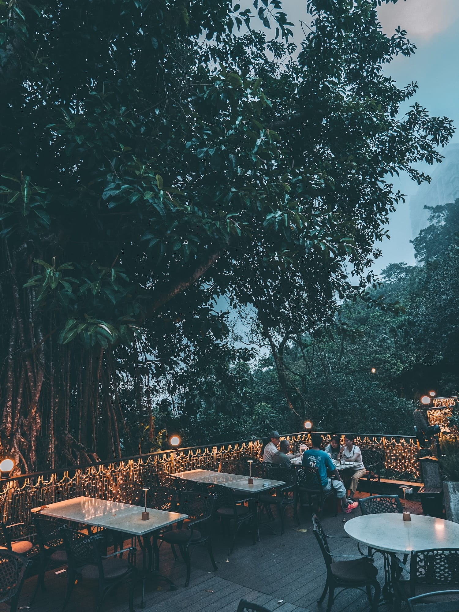

---

## 味蕾上的東西交匯：必點四道招牌名菜

The Peak Lookout 不僅吃環境，其「East meets West」的菜單同樣令人驚艷。當晚我實測了四款招牌美食，每一道都充滿層次與驚喜。

### 1. 法國里昂可內樂 (Quenelles de Crevettes)

在香港極難得能吃到正宗的里昂家常菜。這道菜用紅色的 Staub 鑄鐵鍋熱騰騰地上桌，正中央那件烤得微焦的蝦肉可內樂（Quenelle）口感極度綿密，猶如海鮮風味的雲朵。

整道菜的精華在於那層亮橘紅色的濃郁海鮮醬汁。醬汁中佈滿了鮮甜的蜆肉、魷魚、烤菇與爽脆的羅馬花椰菜，用隨碟附上的厚切香烤大麵包蘸滿濃湯一口咬下，鮮味在口腔中瞬間爆發。

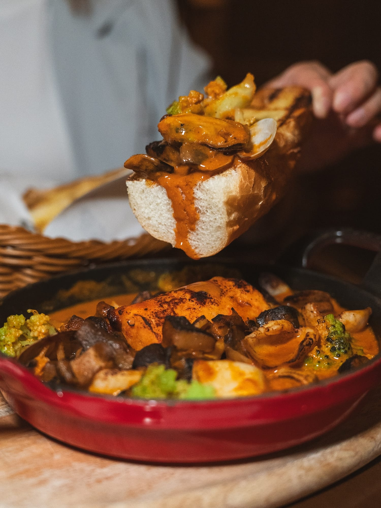

### 2. 香燒皇帝蟹腳海膽汁扁意粉

這是一道將日式旨味與西式烹調完美結合的豪華意粉。每根扁意粉（Linguine）都被金黃香濃、Creamy 至極的海膽汁緊緊包裹。

頂層鋪滿了份量十足的皇帝蟹腳肉，表面帶有明顯的火烤微焦痕跡，吃起來外層微脆，內裡完美保留了蟹肉的清甜。在百年石屋裡品嚐這碟混血美味，絕對是極致享受。

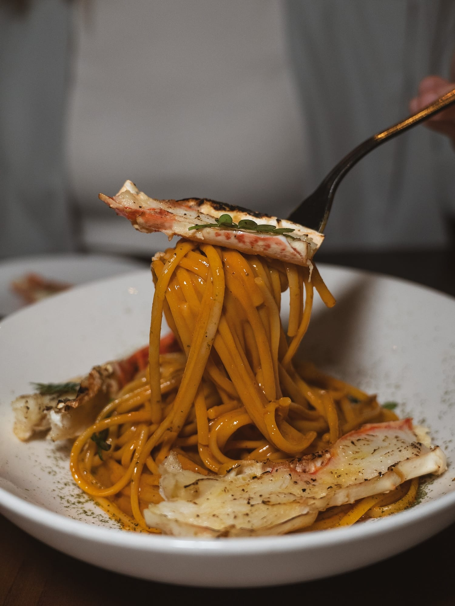

### 3. 煙燻燒烤拼盤 (Smoked Grill Platter)

如果你是與伴侶或三五知己同來，這份份量驚人的美式燒烤拼盤絕對是首選。拼盤將世界各地的 BBQ 文化共冶一爐。

經過 8 至 12 小時低溫慢煮的豬肋骨 (Pork Spare Ribs) 與澳洲和牛牛胸 (Australian Wagyu Brisket)，肉質極度軟腍且充滿油潤感，表面的深色 BBQ 醬散發著迷人的煙燻香。旁邊還有帶有獨特香料味的意大利香腸（Spicy Calabrese & Genovese Sausage）、堆如小山的金黃薯條、紫椰菜沙律與烤粟米，令人大呼過癮。

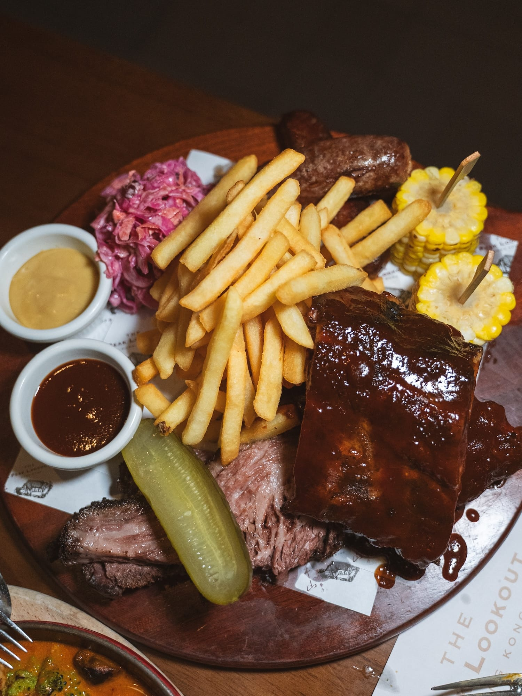

### 4. 太平山牛肉漢堡 (The Peak Lookout Burger)

看似普通的美式漢堡，卻是我吃過「最舒服、最合胃口」的驚喜之作。橫切面完美展示了那塊極度厚實、熟度剛好透著粉紅的美國牛肉漢堡扒，肉汁完全被鎖在鬆軟的麵包內。

頂層半融化的煙燻車打芝士配上一抹焦糖化的紅洋蔥醬（Red onion relish），再加上極具視覺衝擊力的巨大酸青瓜，完美平衡了牛肉的豐腴。坐在戶外露台吹著山風，吃著漢堡，是山頂獨有的愜意。

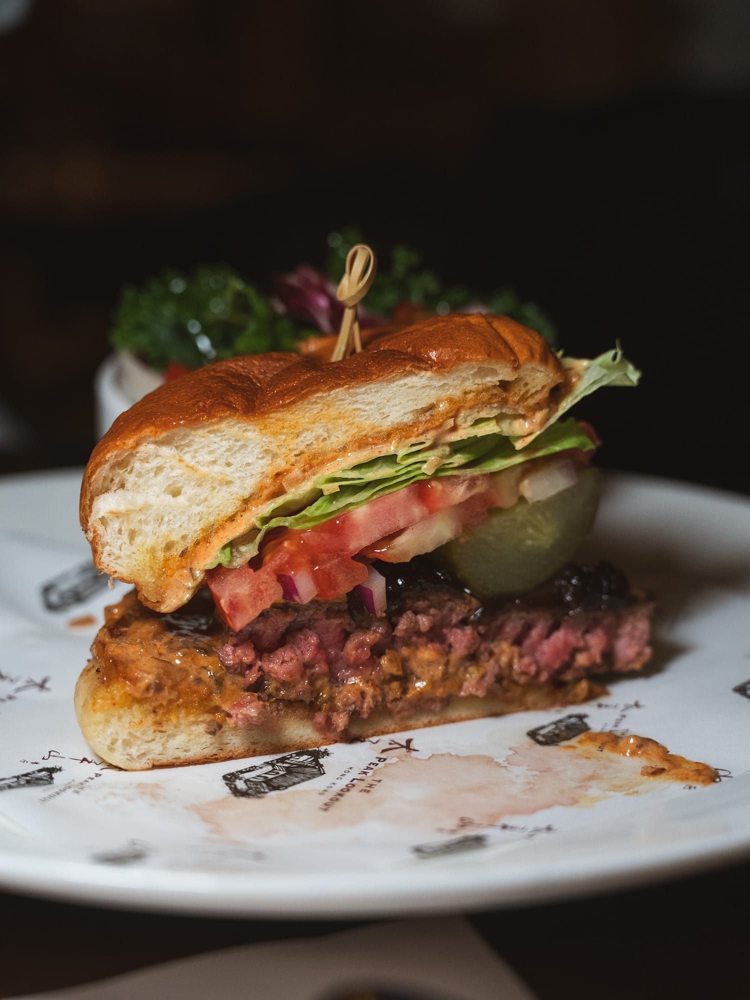

---

## 結語：延續百年的浪漫傳說

從昔日揮汗如雨的轎夫椅棚，到今日燈光搖曳的高級餐廳；一邊是新穎的凌霄閣，一邊是充滿歷史痕跡的紅磚屋。The Peak Lookout 就像一個時空膠囊，把舊香港的優雅與西方飲食文化完美封存。

下次來到太平山頂，別急著跟隨人潮擠進觀景台。給自己留一個傍晚的時間，走進這座百年石屋，在星光與微霧下，享受一頓專屬於你的浪漫晚餐吧。

{/* Affiliate 2: 解決看完食評後的延伸住宿需求 (Target: 港台客 Staycation 或住宿) */}
<AffiliateCard 
  type="agoda"
  title="延續浪漫假期：The Murray, Hong Kong (美利酒店)" 
  description="想延續這份殖民時期的優雅浪漫？位於中環山腳、同樣由歷史建築活化改建的 The Murray 酒店，是完美約會 / 假期的最佳下榻選擇。" 
  link="/go/murray-hotel-agoda" 
  buttonText="查看 Agoda 最新房價" 
/>

{/* Affiliate 3: 解決台灣客打卡剛需，順帶引出相片集 */}
<AffiliateCard 
  type="klook"
  title="打卡必備：香港無限數據 eSIM" 
  description="上到山頂想即時在 IG 分享美景？準備好一張無限數據 eSIM，免去換卡煩惱，到達後即插即用，隨時隨地上線。" 
  link="/go/klook-esim-hk" 
  buttonText="即看 Klook eSIM 優惠" 
/>

---

### Photo Gallery (The Peak Lookout 的光影細節)

  <figure class="snap-center shrink-0 w-[90%] sm:w-80 m-0 flex flex-col">
    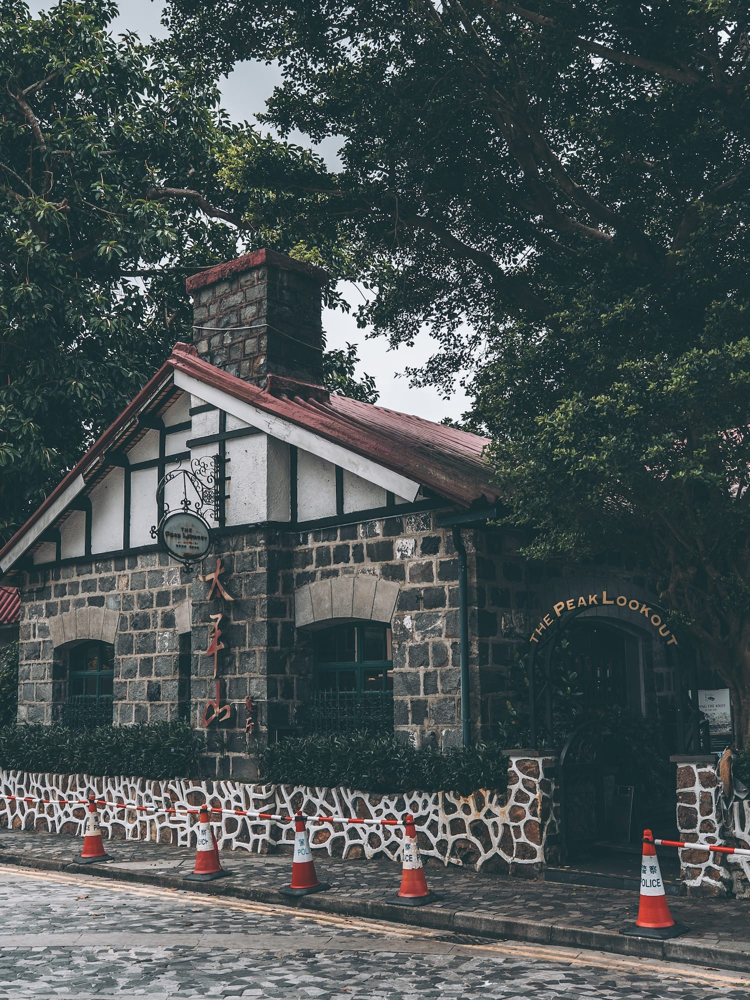
    <figcaption class="text-center text-sm text-muted-foreground mt-3 italic">百年石屋外觀與古樹</figcaption>
  </figure>

  <figure class="snap-center shrink-0 w-[90%] sm:w-80 m-0 flex flex-col">
    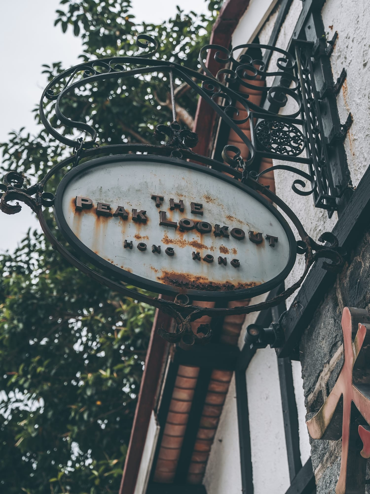
    <figcaption class="text-center text-sm text-muted-foreground mt-3 italic">復古斑駁的鐵藝招牌</figcaption>
  </figure>

  <figure class="snap-center shrink-0 w-[90%] sm:w-80 m-0 flex flex-col">
    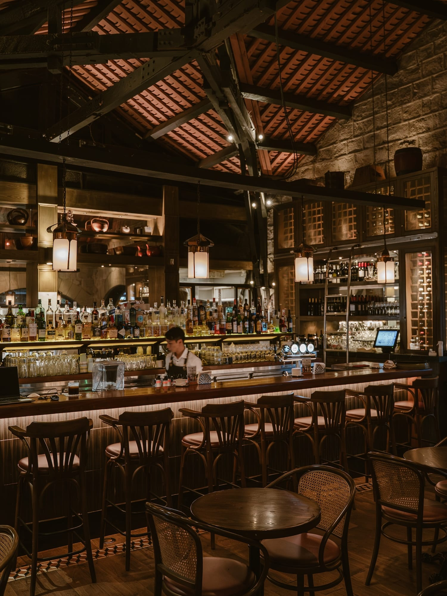
    <figcaption class="text-center text-sm text-muted-foreground mt-3 italic">保留紅瓦屋頂的室內吧台</figcaption>
  </figure>

  <figure class="snap-center shrink-0 w-[90%] sm:w-80 m-0 flex flex-col">
    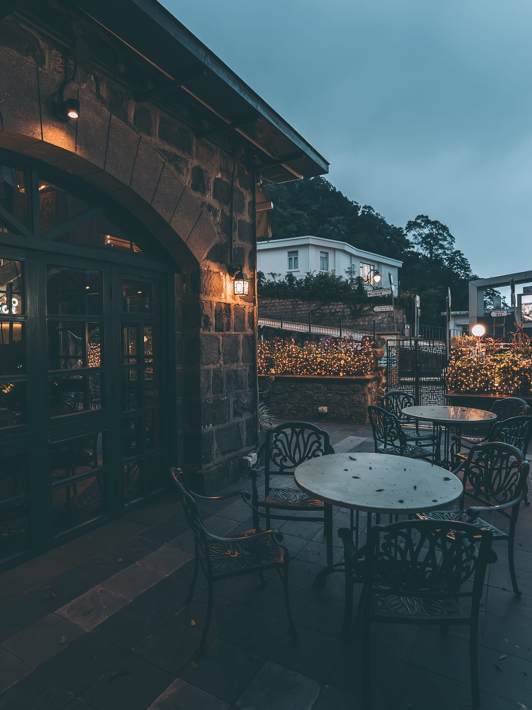
    <figcaption class="text-center text-sm text-muted-foreground mt-3 italic">露天茶座與現代凌霄閣</figcaption>
  </figure>

  <figure class="snap-center shrink-0 w-[90%] sm:w-80 m-0 flex flex-col">
    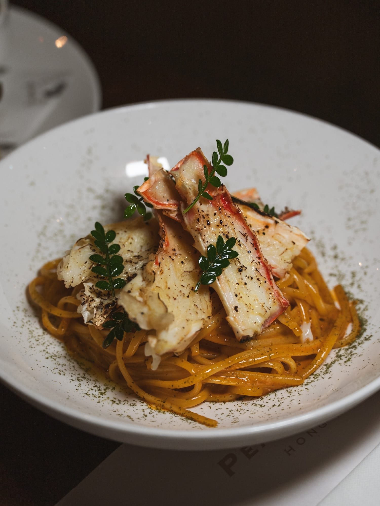
    <figcaption class="text-center text-sm text-muted-foreground mt-3 italic">海膽汁意粉上的焦香蟹腳</figcaption>
  </figure>
  
  <figure class="snap-center shrink-0 w-[90%] sm:w-80 m-0 flex flex-col">
    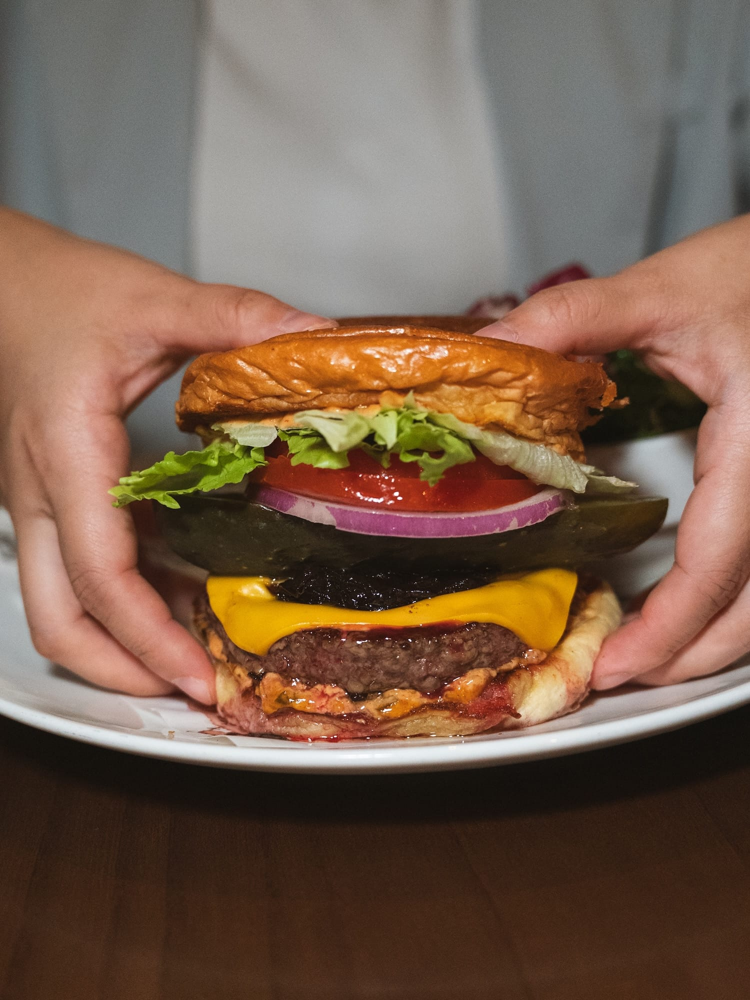
    <figcaption class="text-center text-sm text-muted-foreground mt-3 italic">太平山牛肉漢堡特寫</figcaption>
  </figure>

  <figure class="snap-center shrink-0 w-[90%] sm:w-80 m-0 flex flex-col">
    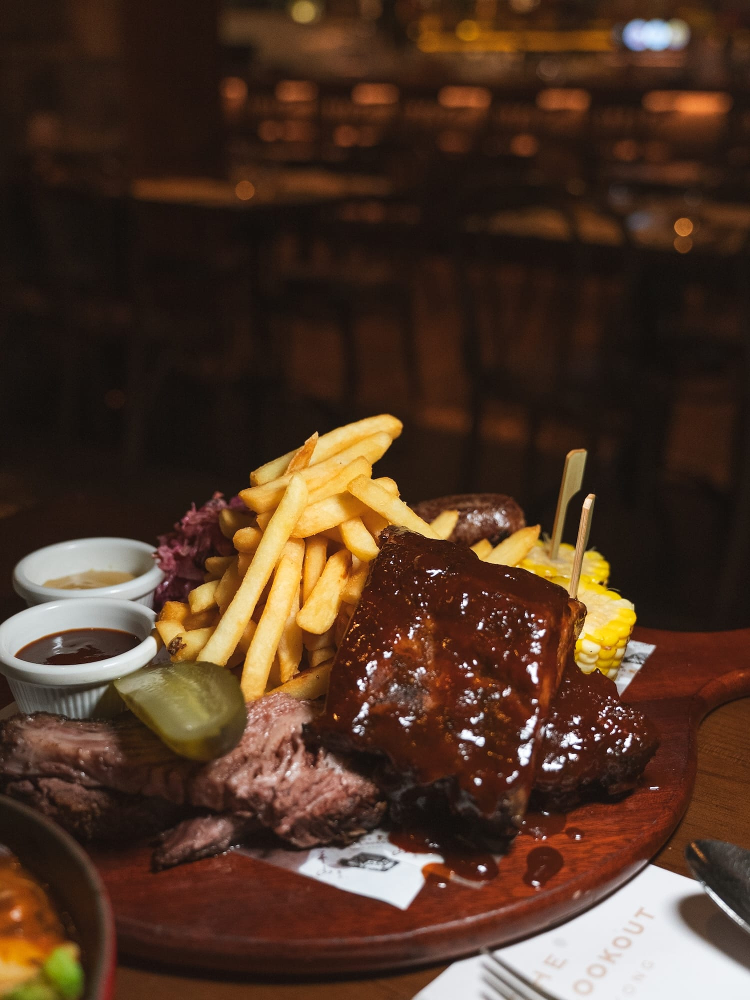
    <figcaption class="text-center text-sm text-muted-foreground mt-3 italic">燒烤拼盤的豐盛配菜</figcaption>
  </figure>

